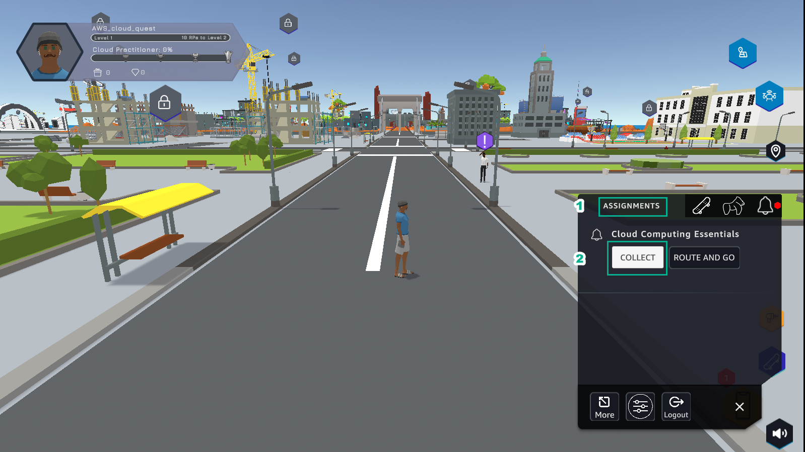
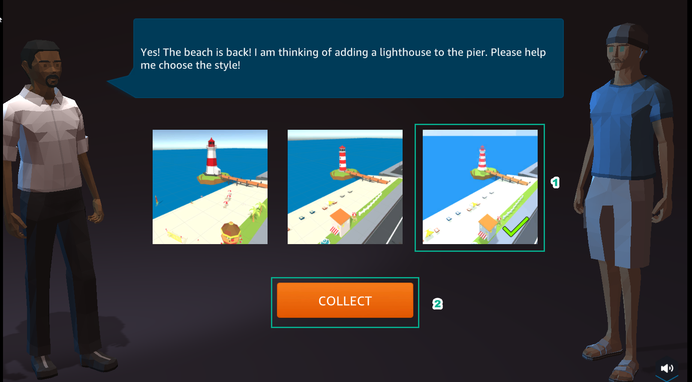

DIY
============

.. admonition:: Info
   :class: tip

    After completing the lab, the player does **DIY**.

1. In the **Practice** interface

- Select **DIY**

2. In the **DIY** interface
- Read **DIY ACTIVITIES**
- Read **SOLUTION VALIDATION METHOD**

3. In the **AWS Console** interface

- Find **S3**
- Select **S3**

.. image:: pictures/0003_diy.png
   :align: center
   :width: 700px

4. In the **Amazon S3** interface

- Select **Buckets**
- Select **lab-unique-name-1**
- Select **index.html**
- Select **Actions**
- Select **Rename object**

.. image:: pictures/0004_diy.png
   :align: center
   :width: 700px

5. In the **Rename object** interface

- Change **index.html** to 
.. raw:: html

   
     waves.html
     <button onclick="navigator.clipboard.writeText(document.getElementById('copy-text').innerText)" style="border:none; background:none; cursor:pointer;">📋</button>
    

- Select **Save changes**

.. image:: pictures/0005_diy.png
   :align: center
   :width: 700px

6. In the **Amazon S3** interface

- View the result of renaming object
- Select **waves.html**

.. image:: pictures/0006_diy.png
   :align: center
   :width: 700px

7. In the **wave.html** interface

- Select **Properties**
- View **Object URL**
- Copy **Object URL**

.. image:: pictures/0007_diy.png
   :align: center
   :width: 700px

8. In the **DIY** interface

- Paste **Object URL** into **VALIDATION FORM**
- Select **VALIDATE**

.. image:: pictures/0008_diy.png
   :align: center
   :width: 700px

9. In the **DIY** interface

- After selecting **VALIDATE, VALIDATION MESSAGE** appears **200 OK. Succcess!**…
- Select **EXIT** to exit

10. In the city interface

- Select **ASSIGNMENTS**
- Select **COLLECT**

11. Select **NEXT**

.. image:: pictures/00011_diy.png
   :align: center
   :width: 700px

12. Select **COLLECT**

13. Congratulations to the player receiving the reward

