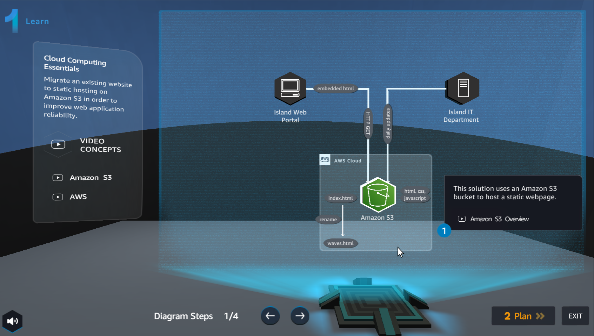
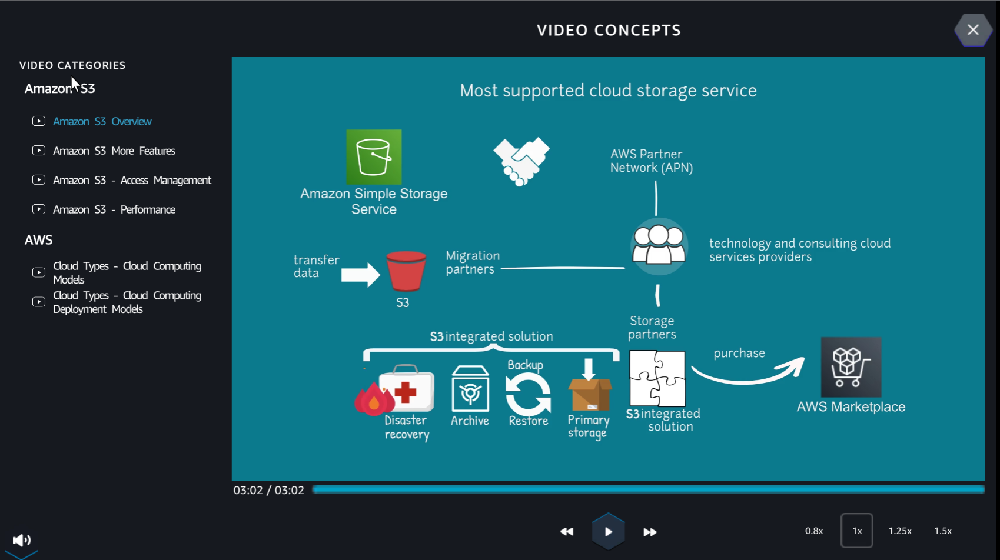
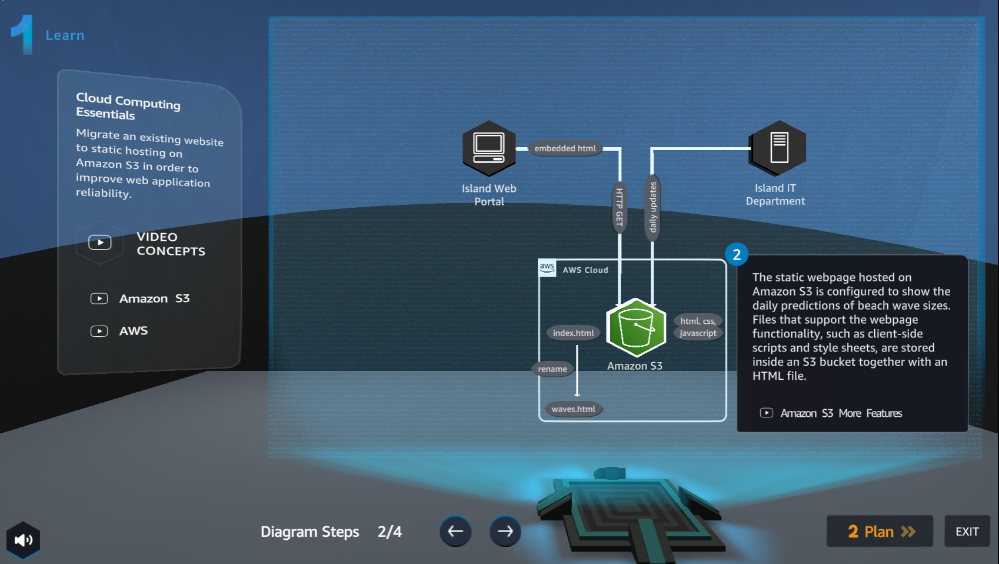
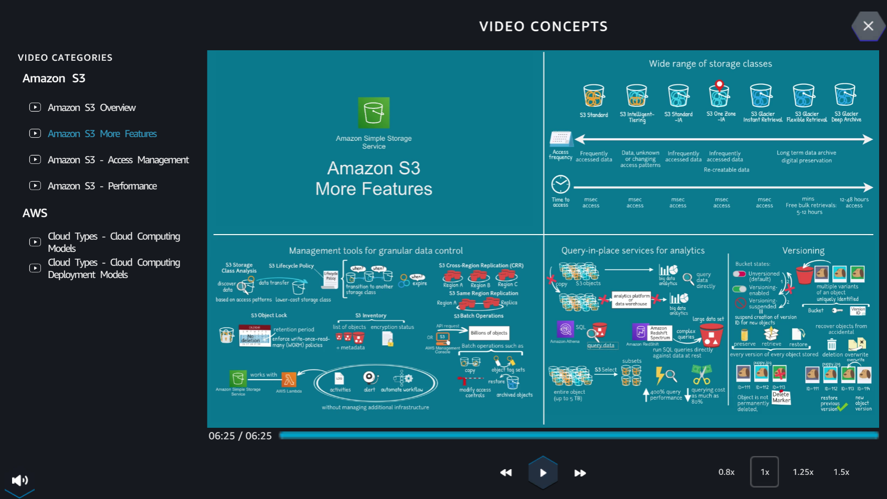
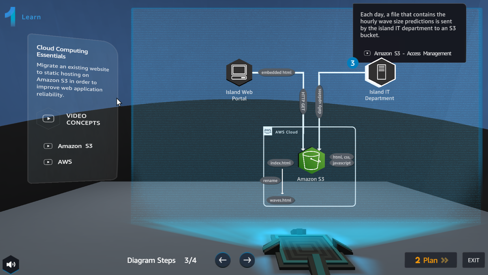
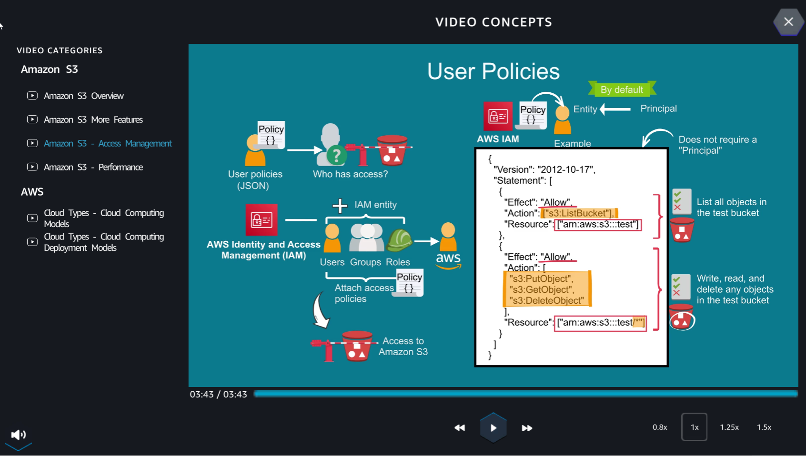
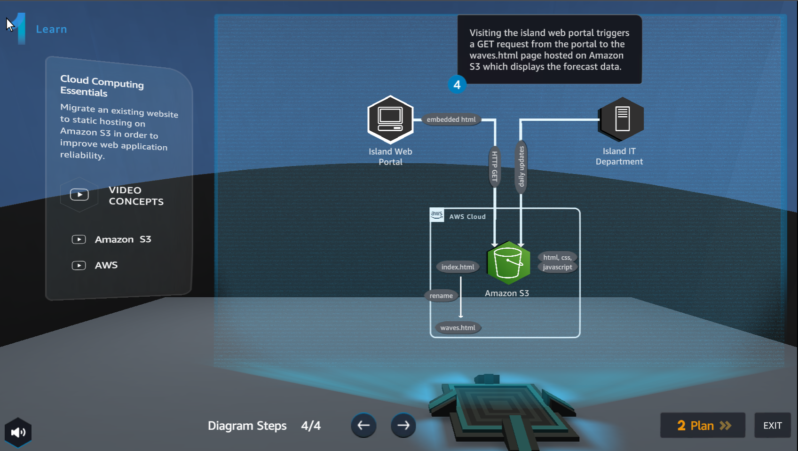

Learn
========

.. admonition:: Info
   :class: tip

   **Learn** helps players understand more about Amazon S3 theory.

1. In the **Learn** interface

- Read step 1 of **Diagram Steps**
- Select **Amazon S3 Overview**
- Select the arrow to the right to see the next steps

2. In the **VIDEO CONCEPTS** interface

- Watch video **Amazon S3 Overview**
- Select **X** to exit

3. In the **Learn** interface

- Read step 2 of **Diagram Steps**
- Select **Amazon S3 More Features**
- Select the arrow to the right to see the next steps

4. In the **VIDEO CONCEPTS** interface

- Watch video **Amazon S3 More Features**
- Select **X** to exit

5. In the **Learn** interface

- Read step 3 of **Diagram Steps**
- Select **Amazon S3 - Access Management**
- Select the arrow to the right to see the next steps

6. In the **VIDEO CONCEPTS** interface

- Watch video **Amazon S3 - Access Management**
- Select **X** to exit

7. In the **Learn** interface

- Read step 4 of **Diagram Steps**
- Select **Plan** to go to **Plan**

