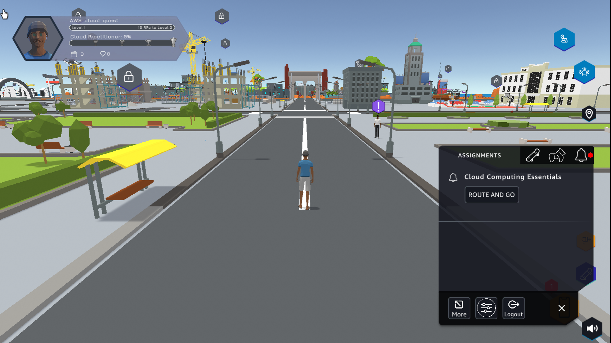
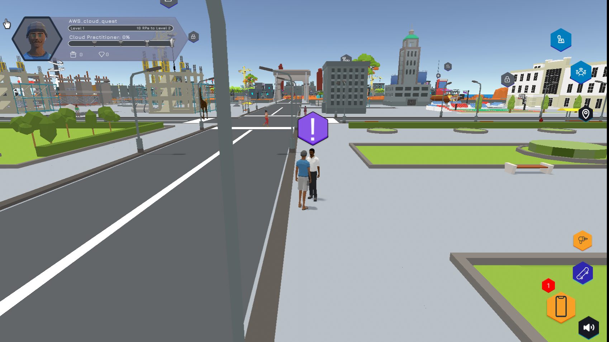
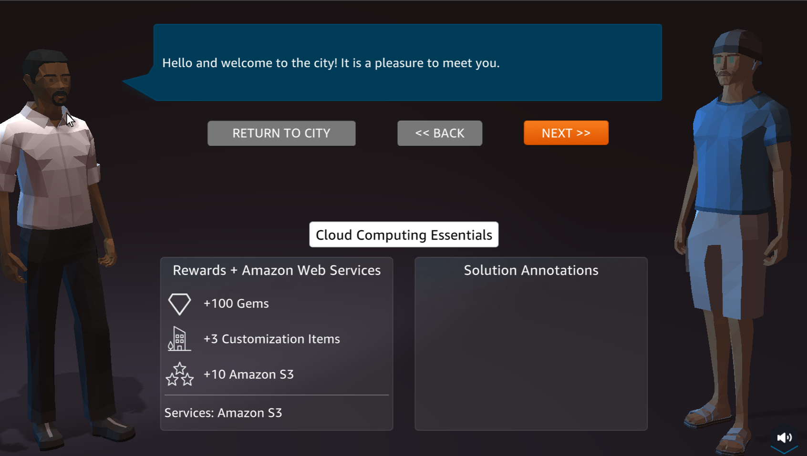
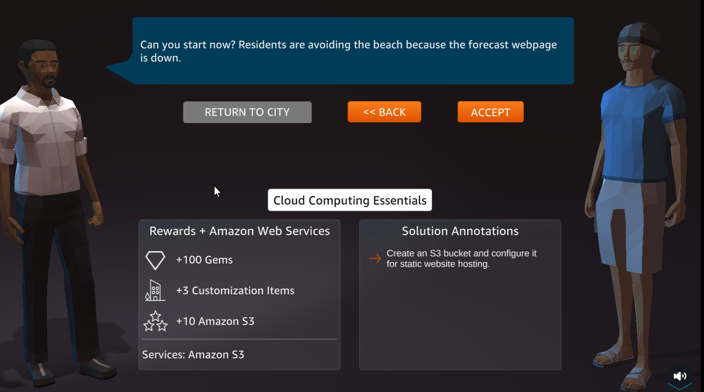
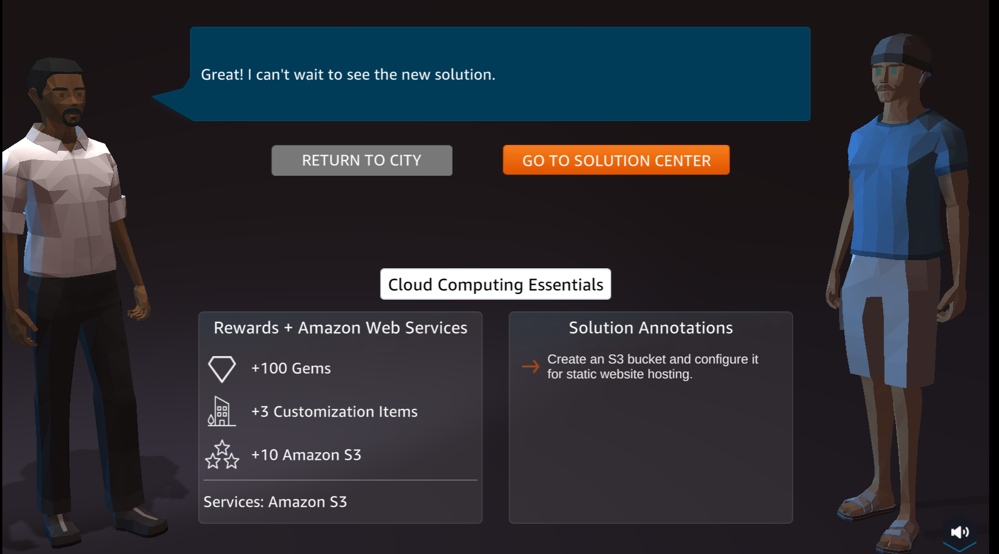
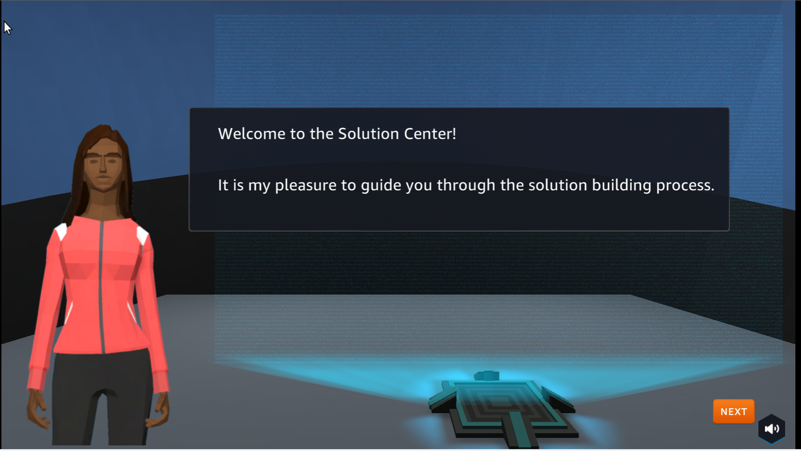
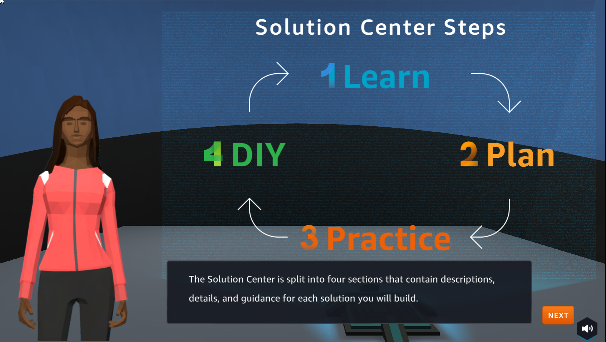

A1 - Static web hosting
==========================

.. raw:: html

   <h2 class="my-header">Overview</h2>

In this step we will take the first challenge in Cloud Quest.

.. raw:: html

   <h2 class="my-header">Content</h2>

.. toctree::
   :maxdepth: 2  
   :titlesonly:
   
   a1 - learn
   a1 - plan
   a1 - practice
   a1 - diy

Perform
---------

1. In the city interface

- Select **ASSIGNMENT**
- In **Cloud Computing Essentials**, select **ROUTE AND GO**

2. Select the ! icon to go to the next step

3. Select **NEXT**

4. In the preparation interface

- View **Rewards**
- See **Solution Annotations**
- Select **ACCEPT**

5. Select **GO TO SOLUTION CENTER**

6. Welcome to **Solution Center**

7. Steps of **Solution Center Steps**

