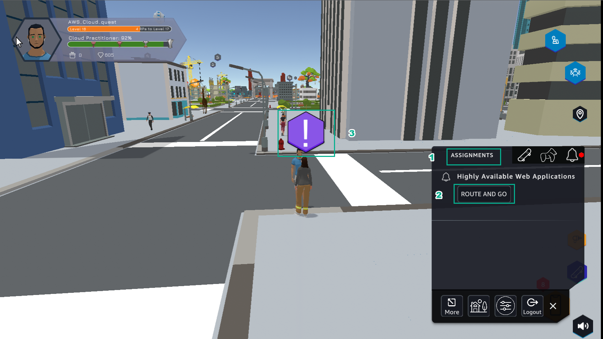
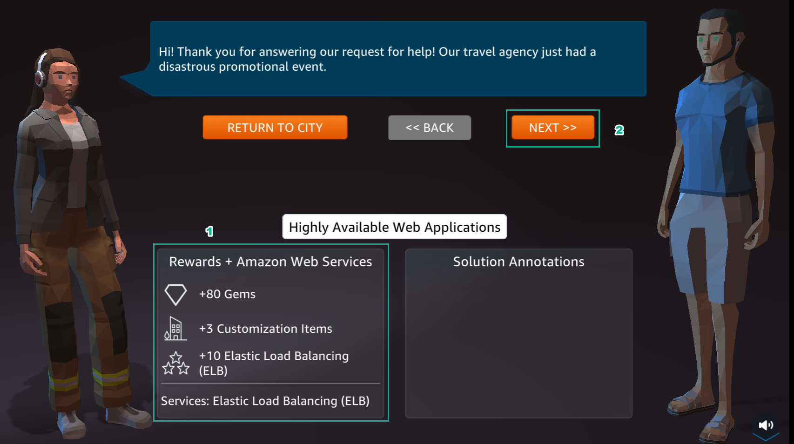
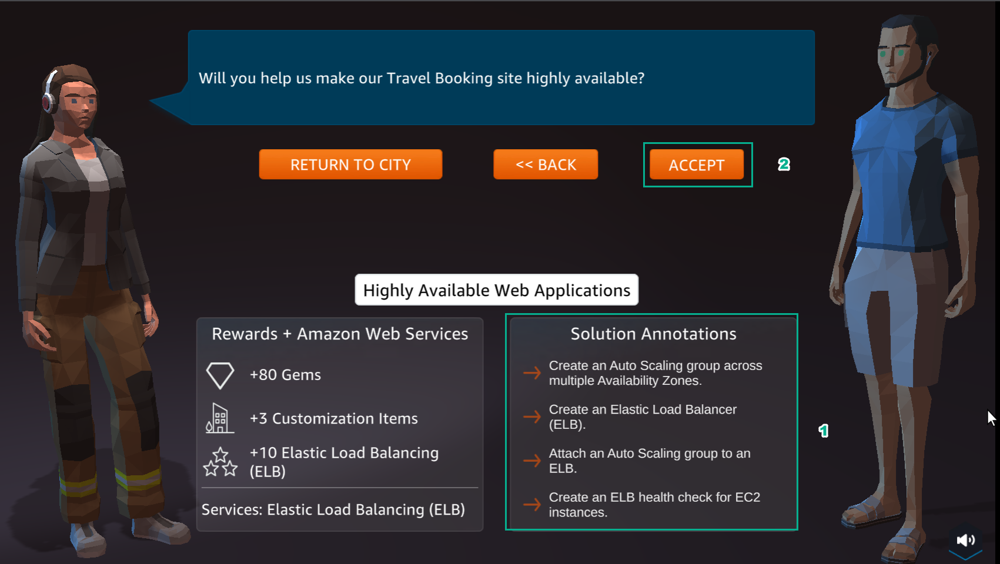
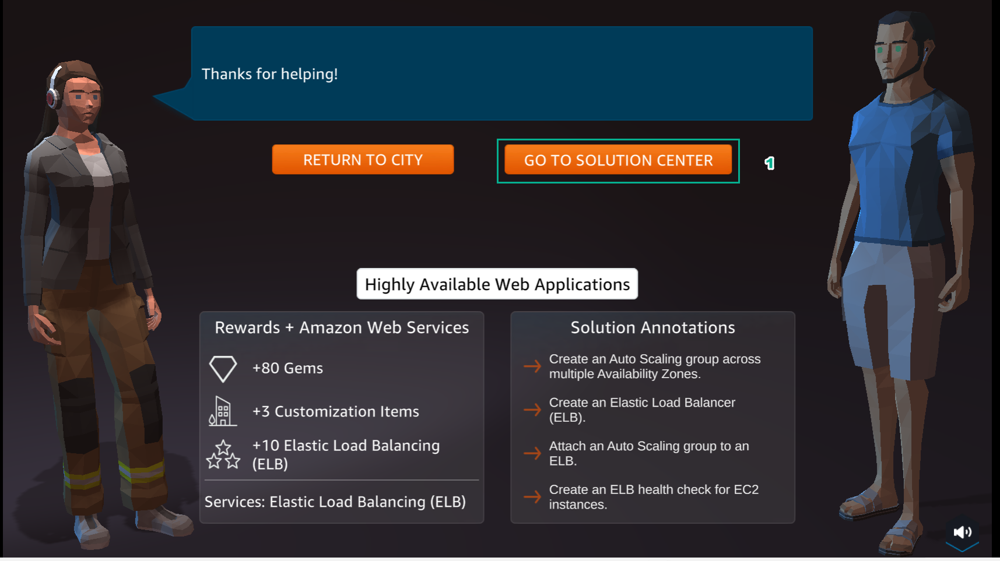

A12 - Highly Available
=====================

.. raw:: html

   <h2 class="my-header">Overview</h2>

Lab number 12 of **AWS Cloud Quest: Cloud Practitioner** is **Implementing Highly Available Web Applicaionts**.

1.In the city interface

- Select **ASSIGNMENTS**
- Select **ROUTE AND GO**

2. In the **Highly Available Web Applications** interface

- View **Rewards**
- Select **NEXT**

3. In the **Highly Available Web Applications** interface

- Read **Solution Annotations**
- Select **ACCEPT**

4. Select **GO TO SOLUTION CENTER**

