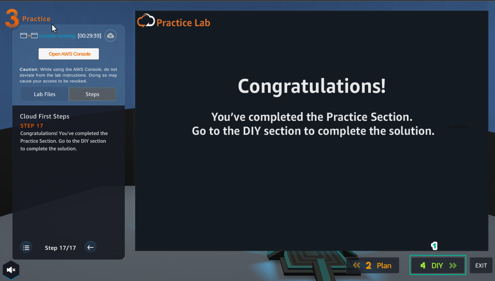

5.2.4 DIY
=========

.. info::

   After completing the lab, the player does **DIY**.

1. Select DIY to make

2. In the **Plan** interface

- Read **DIY ACTIVITIES**
- Read **SOLUTION VALIDATION METHOD**
- Select **Open AWS Console**

.. image:: pictures/0002_a2diy.png
   :align: center
   :width: 700px

3. In **AWS Console**, find and select **EC2**

.. image:: pictures/0003_a2diy.png
   :align: center
   :width: 700px

4. Select **Launch instance**

.. image:: pictures/0004_a2diy.png
   :align: center
   :width: 700px

5. In Choose an **Amazon Machine Image (AMI)**

- Select **Amazon Linux 2 AMI (HVM) - Kernel 5.10, SSD Volume Type**
- Select **Select**

6. In **Choose an Instance Type**

- Select **t2.micro**
- Then select **Next: Configure Instance Details**

7. In **Configure Instance Details**

- Select **VPC**
- Choose **Subnet** different from the subnet of **Practice**

.. image:: pictures/0007_a2diy.png
   :align: center
   :width: 700px

8. In **Advanced Details**

- Select **As file**
- Select **Select file** and download the file **user-data**
- Select **Next: Add Storage**

.. image:: pictures/0008_a2diy.png
   :align: center
   :width: 700px

9. In **Add Storage**, select **Next: Add Tags**

.. image:: pictures/0009_a2diy.png
   :align: center
   :width: 700px

10. In **Add Tags**, select **Next: Configure Security Group**

11. In **Configure Security Group**, create a security group

- Security group name, enter 
.. raw:: html

   
     Security-Group-Lab-2
     <button onclick="navigator.clipboard.writeText(document.getElementById('copy-text').innerText)" style="border:none; background:none; cursor:pointer;">📋</button>
   

- Description, enter 
.. raw:: html

   
     HTTP Group Lab 2
Rule
     <button onclick="navigator.clipboard.writeText(document.getElementById('copy-text').innerText)" style="border:none; background:none; cursor:pointer;">📋</button>
   
- Rule, select **HTTP**
- Select **Review and Launch**

12. In **Review Instance Launch**, double check and select **Launch**

.. image:: pictures/00012_a2diy.png
   :align: center
   :width: 700px

13. In **Select an existing key pair or create a new key pair**

- Select **Proceed without a key pair**
- Select **I acknowledge…**
- Select **Launch Instances**

.. image:: pictures/00013_a2diy.png
   :align: center
   :width: 700px

14. Select **View Instances**

.. image:: pictures/00014_a2diy.png
   :align: center
   :width: 700px

15. Result of creating 2 **Amazon EC2 Instance**

.. image:: pictures/00015_a2diy.png
   :align: center
   :width: 700px

16. After creating 2 **Amazon EC2 Instance**, copy both **Instance ID**

- Paste in **Instance ID in AZ1**
- Paste in **Instance ID in AZ2**
- Select **VALIDATE**

.. image:: pictures/00016_a2diy.png
   :align: center
   :width: 700px

17. After selecting **VALIDATE**, if **VALIDATION MESSAGE** contains **Success!** … is complete

.. image:: pictures/00017_a2diy.png
   :align: center
   :width: 700px

18. Select **EXIT**

.. image:: pictures/00018_a2diy.png
   :align: center
   :width: 700px

19. In **ASSIGNMENT** select **COLLECT**

20. Select **NEXT**

21. Select **COLLECT**

.. image:: pictures/00021_a2diy.png
   :align: center
   :width: 700px

22. Get rewarded

.. image:: pictures/00022_a2diy.png
   :align: center
   :width: 700px

