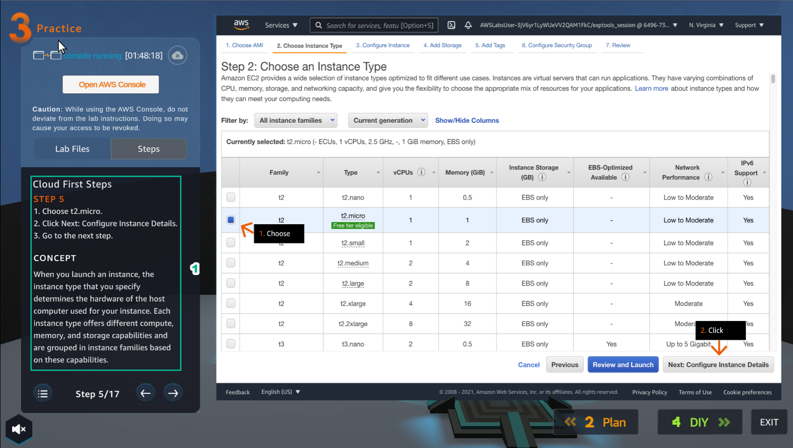
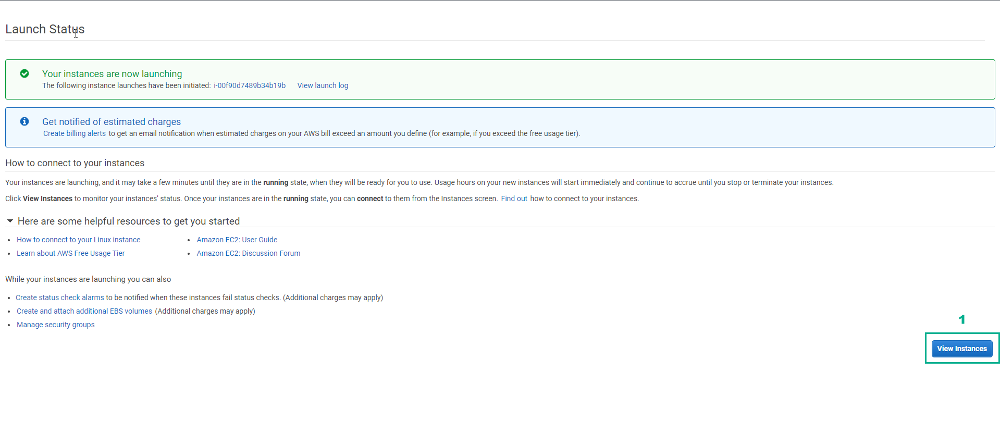
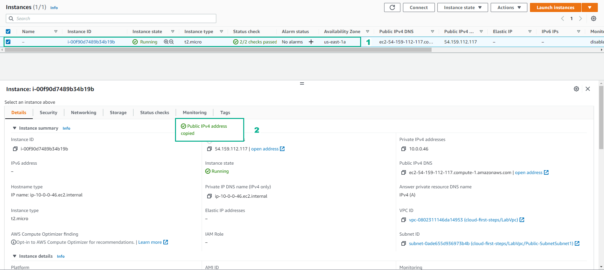

Practice
=========
  
.. info::

    After watching **Plan**, the player prepares for **Practice**

1. Select **Practice** to perform the lab

.. image:: pictures/0001_a2practice.png
   :align: center
   :width: 700px

2. Read the first step of **Cloud First Steps** and **CONCEPT**

- Select **START LAB**
- Select the arrow to the right to perform the next steps

3. Select **Open AWS Console**

- Read step 2 of **Cloud First Steps**

.. image:: pictures/0003_a2practice.png
   :align: center
   :width: 700px

4. Go to **AWS Console** page

- Find EC2 service and select

.. image:: pictures/0004_a2practice.png
   :align: center
   :width: 700px

5. Read step 3 of **Cloud First Steps**

- Select the arrow to the right to view and take the next step

.. image:: pictures/0005_a2practice.png
   :align: center
   :width: 700px

6. Go to **AWS Console** page

- Select **EC2 Dashboard**
- Select **Launch instance**
- Continue to select **Launch instance**

.. image:: pictures/0006_a2practice.png
   :align: center
   :width: 700px

7. Read step 4 of **Cloud First Steps**

.. image:: pictures/0007_a2practice.png
   :align: center
   :width: 700px

8. Go to **AWS Console** page

- Select **Amazon Linux 2 AMI**

.. image:: pictures/0008_a2practice.png
   :align: center
   :width: 700px

9.Read step 5 of **Cloud First Steps**

10. Go to **AWS Console** page

- **Choose an Instance Type**, select **t2.micro**
- Select **Next: Configure Instance Details**

11. Read step 6 of **Cloud First Steps**

- Select **Lab Files**

.. image:: pictures/00011_a2practice.png
   :align: center
   :width: 700px

12.After selecting **Lab Files**, select **user-data** and download it
Practice

.. image:: pictures/00012_a2practice.png
   :align: center
   :width: 700px

13. Read step 7 of **Cloud First Steps**

.. image:: pictures/00013_a2practice.png
   :align: center
   :width: 700px

14. Go to **AWS Console**

- Select **VPC**
- Select **Subnet**

15.Read step 8 of **Cloud First Steps**

.. image:: pictures/00015_a2practice.png
   :align: center
   :width: 700px

16.In the **Configure Instance Details** section

- In **Advanced Details**, select **As file**
- Select **Select file**, and load the file **user-data**
- Then, select **Next: Add Storage**

.. image:: pictures/00016_a2practice.png
   :align: center
   :width: 700px

17. Read step 9 of **Cloud First Steps**

.. image:: pictures/00017_a2practice.png
   :align: center
   :width: 700px

18. Select **Next: Add Tags**

.. image:: pictures/00018_a2practice.png
   :align: center
   :width: 700px

19. Read step 10 of **Cloud First Steps**

.. image:: pictures/00019_a2practice.png
   :align: center
   :width: 700px

20.Select **Next: Configure Security Group**

21. Read step 11 of **Cloud First Steps**

22. Create a security group

- **Security group name**, enter
.. raw:: html

   
     Security-Group-Lab
     <button onclick="navigator.clipboard.writeText(document.getElementById('copy-text').innerText)" style="border:none; background:none; cursor:pointer;">📋</button>
   

- **Description**, enter 
.. raw:: html

   
     HTTP Group Lab
     <button onclick="navigator.clipboard.writeText(document.getElementById('copy-text').innerText)" style="border:none; background:none; cursor:pointer;">📋</button>
   
- **Rule**, select **HTTP**
- Select **Review and Launch**

.. image:: pictures/00022_a2practice.png
   :align: center
   :width: 700px

23. Read step 12 of **Cloud First Steps**

24. Double check and select **Launch**

.. image:: pictures/00024_a2practice.png
   :align: center
   :width: 700px

25. Read step 13 of **Cloud First Steps**

.. image:: pictures/00025_a2practice.png
   :align: center
   :width: 700px

26. Select **Proceed without a key pair**

- Select **I acknowledge…**
- Select **Launch Instances**

27. Read step 14 of **Cloud First Steps**

.. image:: pictures/00027_a2practice.png
   :align: center
   :width: 700px

28. Select **View Instance**

29. Read step 15 of **Cloud First Steps**

.. image:: pictures/00029_a2practice.png
   :align: center
   :width: 700px

30. Select the **Amazon EC2 instance** just created

- Find and copy **Public(IPv4) DNS name**

31. Read step 16 of **Cloud First Steps**

32. Paste **Public(IPv4) DNS name** into the browser and **Enter**

.. image:: pictures/00032_a2practice.png
   :align: center
   :width: 700px

- View results

33. Congratulations to the player on completing the lab
