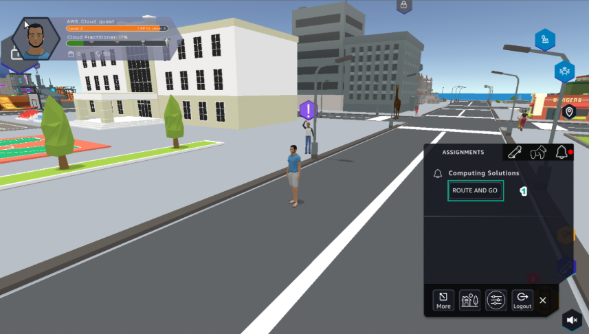
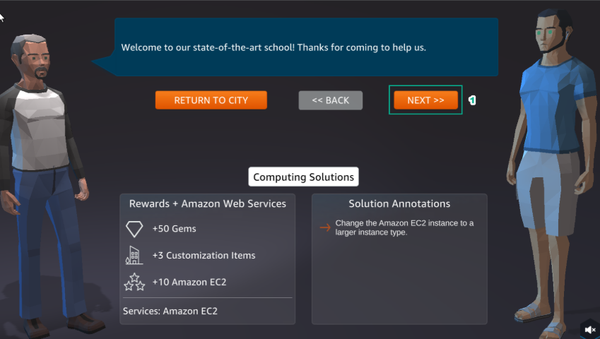
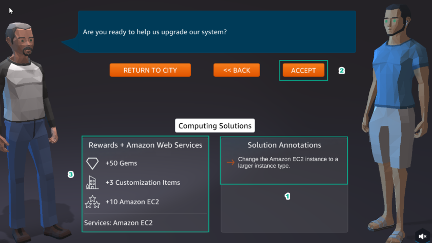
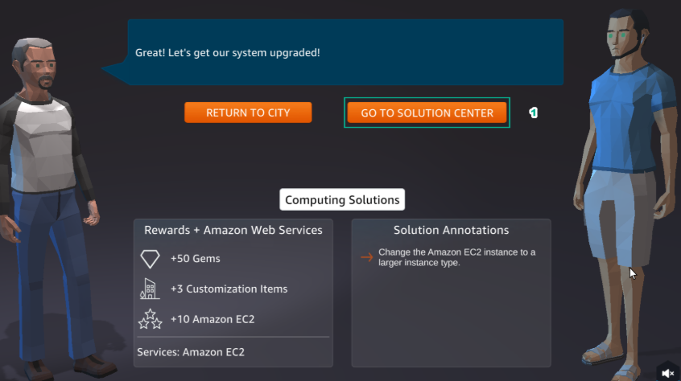

A3 - Connect to an EC2 Instance
=================================

Lab #3 of **AWS Cloud Quest: Cloud Practitioner** is **Connect to an EC2 Instance**

.. info::

   After receiving the Assignment 2 award, continue to perform the following steps to perform Assignment 3.

1. In ASSIGNMENT, select **ROUTE AND GO**

2.Select **NEXT**

3.Read **Computing Solutions** and select **ACCEPT**.

Select GO TO **SOLUTION CENTER**.

