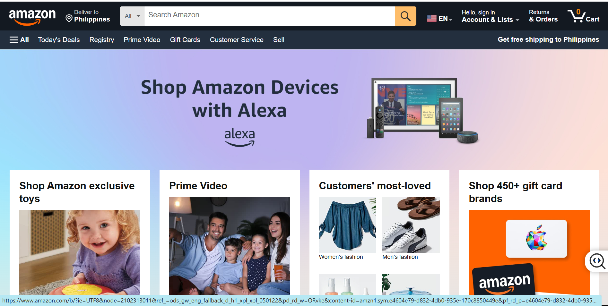

DIY
===========

.. info::

  After completing the lab, the player does DIY

1. Select **DIY**

2. In the **DIY** interface

- Read **DIY ACTIVITIES**

- Read **SOLUTION VALIDATION METHOD**

3.For this **DIY**, we do **To change the instance type for a new instance configuration**

- Go to the AWS Console page, find and select **EC2**

3. In **EC2** interface

- Select **Instances**

- Select **Launch instances**

4. In **Choose an Amazon Machine Image (AMI)**

- Select **Amazon Linux 2 AMI (HVM) - Kernel 5.10, SSD Volume Type**

- Select **Select**

5. In **Choose an Instance Type**

- Select **m4.large**

- Then, select Next: **Configure Instance Details**

6. In **Configure Instance Details**

- Select **VPC**

- Select **subnet**

- Select **Next: Add Storage**

7. In **Add Storage**, select **Next: Add Tags**

8. In **Add Tags**, Select **Next: Configure Security Group**

9. In **Configure Security Group**

- Select **Select an existing security group**

- Select **Security Group ID**

- Select **Review and Launch**

10. In **Review Instance Launch**

- Check again and select **Launch**

11. In **Select an existing key pair or create a new key pair**

- Select **Proceed without a key pair**

- Select **I acknowledge…**

- Select **Launch Instances**

12. Select **View Instances**

13. Copy Instance **ID**

14. In the **DIY** interface

- Paste **Instance ID** into **VALIDATION FORM**

- Then select **VALIDATE**

15. After selecting **VALIDATE**

- **VALIDATION MESSAGE** displays **Success!**

- Then select **EXIT**

16. In **ASSIGNMENT** select **COLLECT**

17. Select **NEXT**

18. Select **COLLECT**

19. Congratulations on completing Assignment 3

