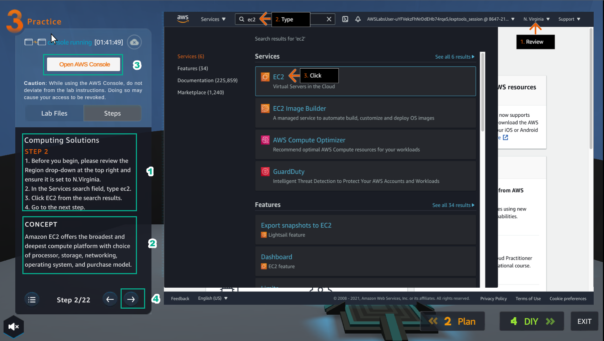

PRACTICE

________________

.. info::

   After watching **Plan**, the player prepares for **Practice**.

1. Select **Practice** to perform the lab

.. image:: pictures/04-practice.png
   :align: center
   :width: 700px

2. In the **Practice** interface.

-Read step 1 of **Computing Solutions**
-Read **CONCEPT**
-Select **START LAB**
-Select the arrow to the right to see the next steps

.. image:: pictures/05-practice.png
   :align: center
   :width: 700px

3. In the **Practice** interface

-Read step 2 of **Computing Solutions**

-Read **CONCEPT**

-Select **Open AWS Console**

=Select the arrow to the right to see the next steps

