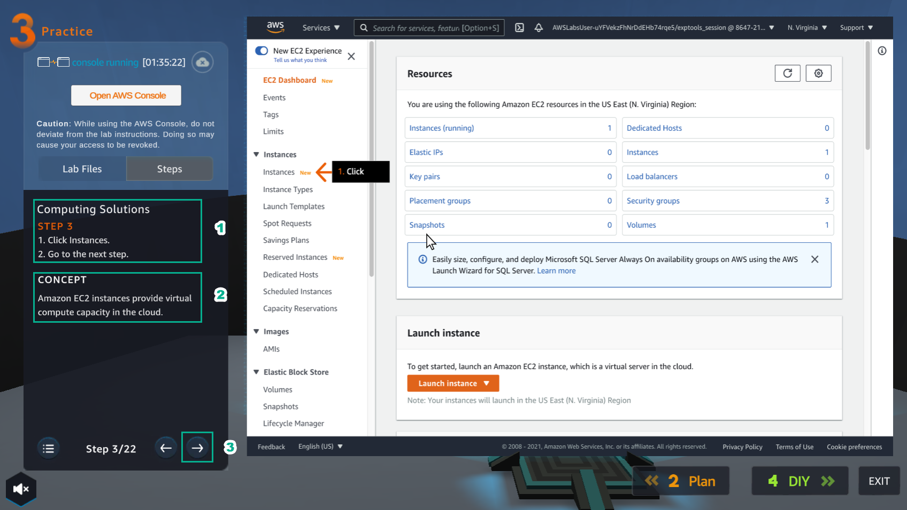
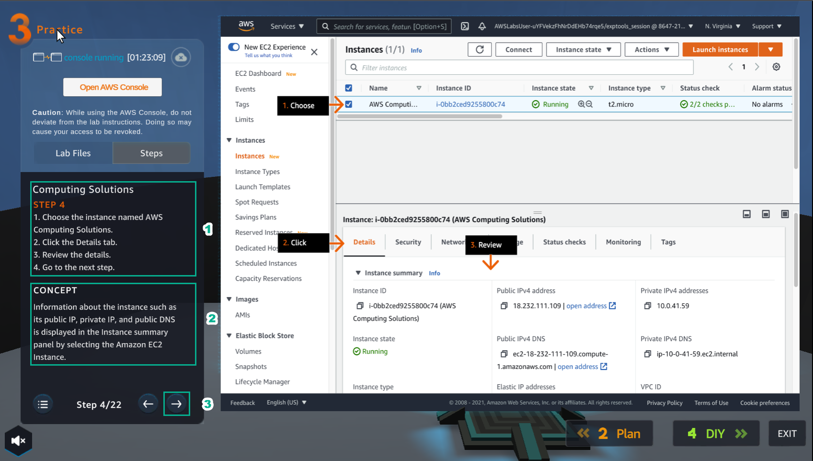

PRACTICE

________________

.. info::

   After watching **Plan**, the player prepares for **Practice**.

1. Select **Practice** to perform the lab

.. image:: pictures/04-practice.png
   :align: center
   :width: 700px

2. In the **Practice** interface.

-Read step 1 of **Computing Solutions**

-Read **CONCEPT**

-Select **START LAB**

-Select the arrow to the right to see the next steps

.. image:: pictures/05-practice.png
   :align: center
   :width: 700px

3. In the **Practice** interface

-Read step 2 of **Computing Solutions**

-Read **CONCEPT**

-Select **Open AWS Console**

-Select the arrow to the right to see the next steps

.. image:: pictures/06-practice.png
   :align: center
   :width: 700px

4. In the **AWS Console interface**

-Find **EC2**

-Select **EC2**

.. image:: pictures/07-practice.png
   :align: center
   :width: 700px

5. In the **Practice** interface

-Read step 3 of **Computing Solutions**

-Read **CONCEPT**

-Select the arrow to the right to see the next steps

6. In the **EC2** interface, select **Instances**

.. image:: pictures/09-practice.png
   :align: center
   :width: 700px

7. In the **Practice** interface

-Read step 4 of **Computing Solutions**

-Read **CONCEPT**

-Select the arrow to the right to see the next steps

