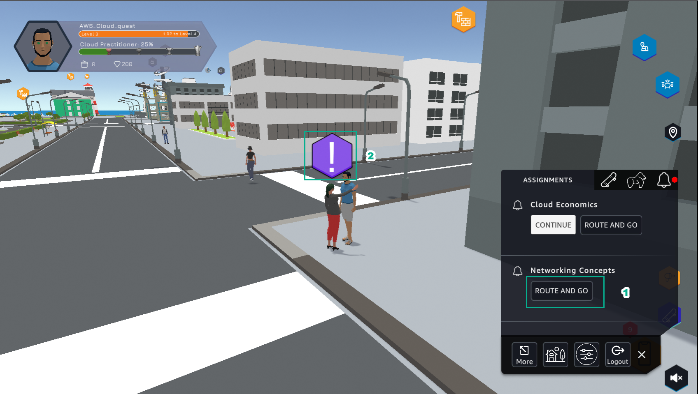
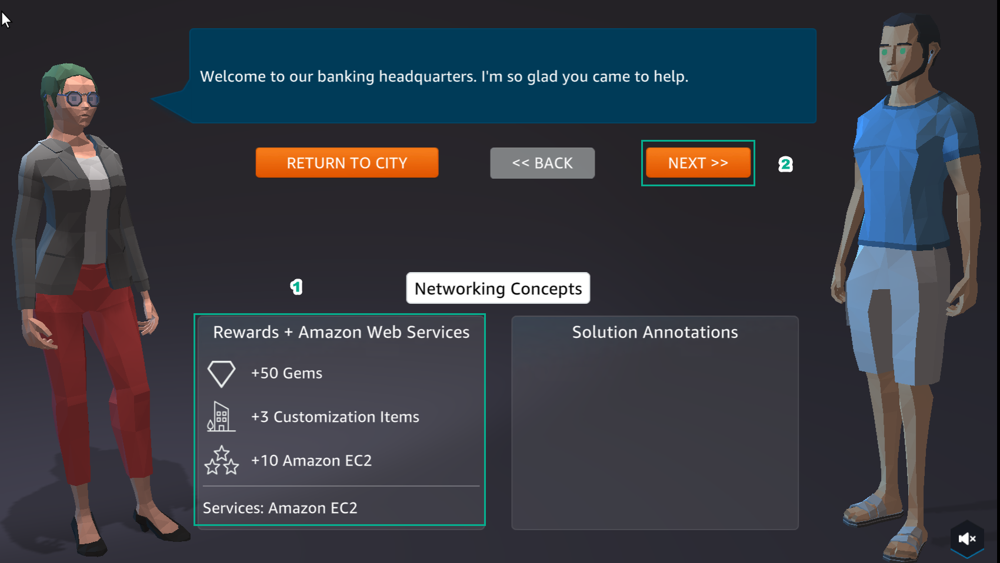
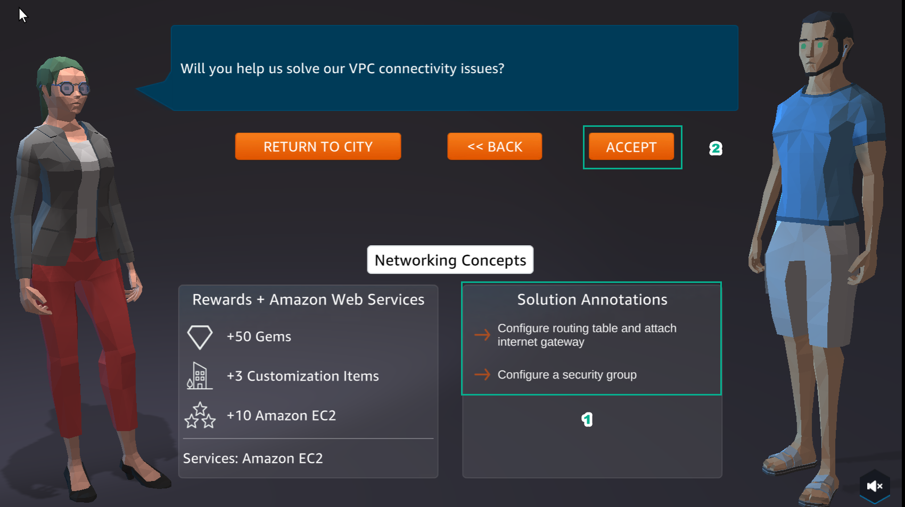
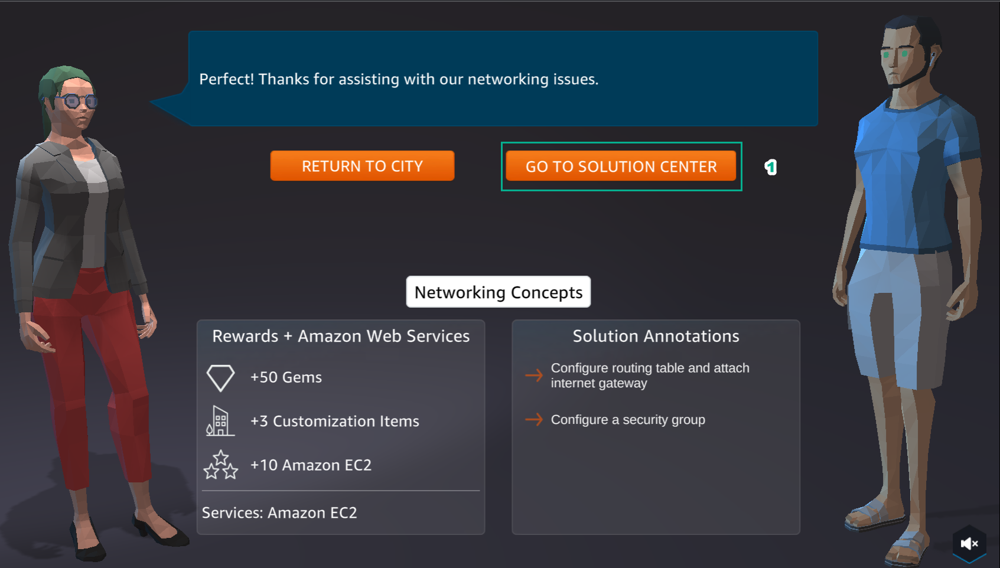

A4 - Internet Access for VPC Resources
=====================================

.. raw:: html

   <h2 class="my-header">Overview</h2>

Lab #4 of **AWS Cloud Quest: Cloud Practitioner** is **Internet Access for VPC Resources**

.. raw:: html

   <h2 class="my-header">Content</h2>

- `Learn <a4- learn>`_

.. toctree::
   :maxdepth: 1
   :titlesonly:

   a4- learn
   a4 - plan
   a4 - practice
   a4 - diy

.. raw:: html

   <h2 class="my-header">Perform</h2>

.. info::

   After receiving the Assignment 3 award, continue to perform the following steps to perform Assignment 4

1. In **ASSIGNMENT**
 - In **Networing Concepts**, select **ROUTE AND GO**
- Select the icon as shown

2. View **Rewards** and select **NEXT**

3. View **Solution Annotations** and select **ACCEPT**

4. Select **GO TO SOLUTION CENTER**, to proceed to the next steps

