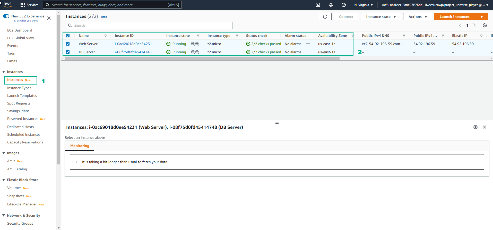
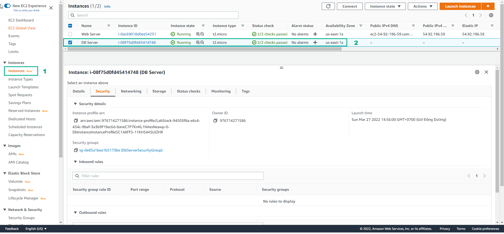

DIY

============

.. info::

   After completing the lab, the player does **DIY**

Select **DIY**

.. image:: pictures/0001a4-diy.png
   :align: center
   :width: 700px

2. The **DIY** interface appears including:

- Lab Files

- DIY Activity

- Networking Concepts

- VALIDATION FORM

- Read **SOLUTION VALIDATION METHOD**

.. image:: pictures/0002a4-diy.png
   :align: center
   :width: 700px

3. In the **AWS Console** page, find and select **EC2**

4. Select **Instances**

- Select **Security**

- In **Security groups**, select **DbServerSecurityGroup**

