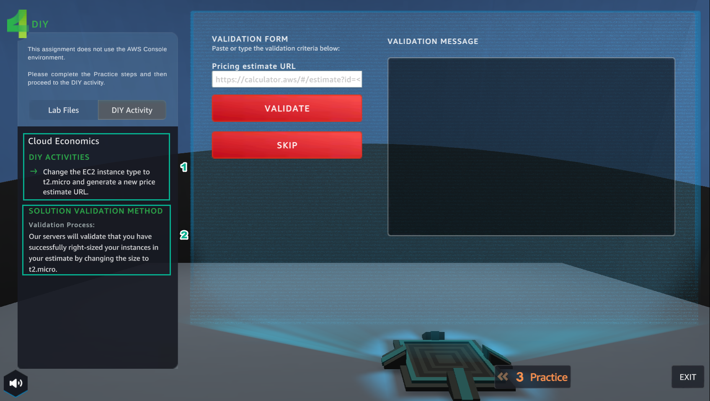
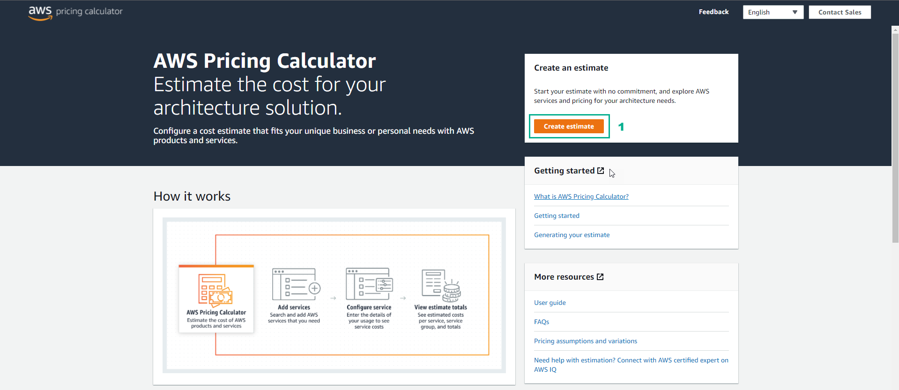
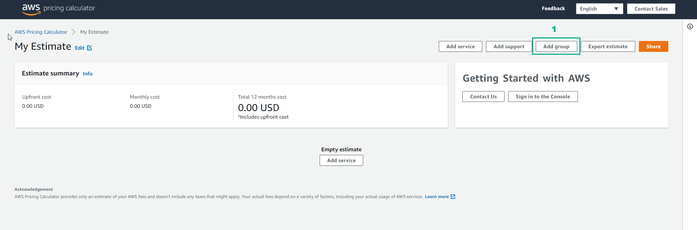
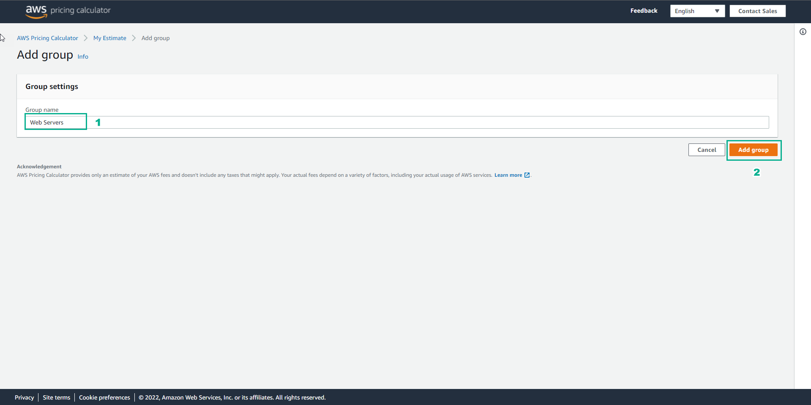

DIY
====================

.. info::

  After completing the lab, the player does **DIY**

1. In the **DIY** interface

- Read **DIY ACTIVITIES**

- Read **SOLUTION VALIDATION METHOD**

2. Go to the **AWS Pricing Calculator**

- Select **Create estimate**

3. In **My Estimate**

- Select **Add group**

4. In **Add group**

- **Group name**, enter Web Servers

- Select **Add group**

5. In the **Web Servers** interface

- Select **Add service**

6. In **Add service**

- Search **EC2**

- Select **Configure**

7. In **Configure Amazon EC2**

- **Description**, enter Web Server Estimate

- **Region**, select **US East (N. Virginia)**

- In **EC2 instance specifications**, select **Linux**

8. In the **Workload** interface

- Select **Daily spike traffic**

- **Daily spike pattern**, **Workload days section**, choose the days of the week

- **Baseline**, enter 2

- **Peak**, enter 4

- **Duration of peak**, enter 8 and 0

9. In **EC2** Instances

- Select **t2.micro**

10. In **Pricing strategy**

- **Pricing model**, select **On-demand**

- Select **Show calculations**

- Select **estimate workload hours**

11. In **Amazon Elastic Block Storage (EBS)**

- **Storage for each EC2 instance** select **General Purpose SSD (gp2)**

- **Storage amount**, enter 30

- **Snapshot Frequency**, enter **Weekly**

- **Amount changed per snapshot**, enter 1

12. View results **Estimated workload hours**

13. In **Data Transfer**

- **Inbound Data Transfer**, select **Internet (free)**

- Select 1

- Select **TB per month**

- **Outbound Data Transfer**, select **Internet ($0.05 - $0.09 per GB)**

- Select 100

- Select **TB per month**

14. Select **Show calculations**

- View and select **Add to my estimate**

15. In the **Web Servers** interface

- Select **Share**

16. In the **Save estimate** interface

- Select Copy **public link**

17. After **Copy public link**

- Enter the **DIY** interface

- Paste in **VALIDATION FORM**

- Select **VALIDATE**

- On **VALIDATION MESSAGE**, appearing **Great job!**… is completed **DIY**

- Then select **EXIT** to exit

18. After the city interface

- Go to **ASSIGNMENT**, select **COLLECT**

19. Select **NEXT**

20. Select **COLLECT**

21. Congratulations to the player receiving the reward

