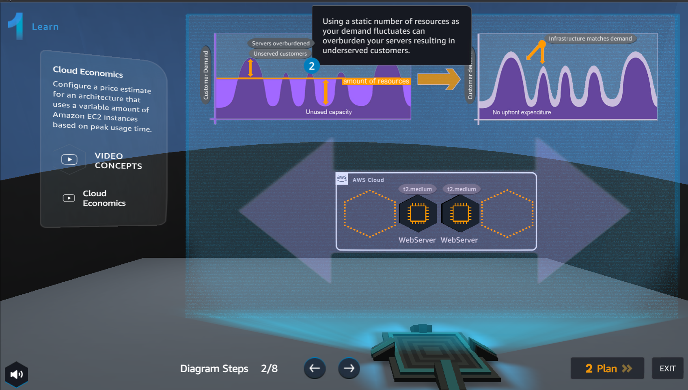

Learn
===========

.. info::

  **Learn** helps players understand more theory about **Amazon Pricing Calculator**

1. In **Learn** interface, see step 1 of **Diagram Steps**

2. In **Learn** interface, see step 2 of **Diagram Steps**

3. In **Learn** interface, see step 3 of **Diagram Steps**

4. In **Learn** interface, see step 4 of **Diagram Steps**

.. image:: pictures/0004a5-learn.png
   :align: center
   :width: 700px

5. In **Learn** interface, see step 5 of **Diagram Steps**

6. In **Learn** interface, see step 6 of **Diagram Steps**

7. In **Learn** interface, see step 7 of **Diagram Steps**

8. In **Learn** interface, see step 8 of **Diagram Steps**

