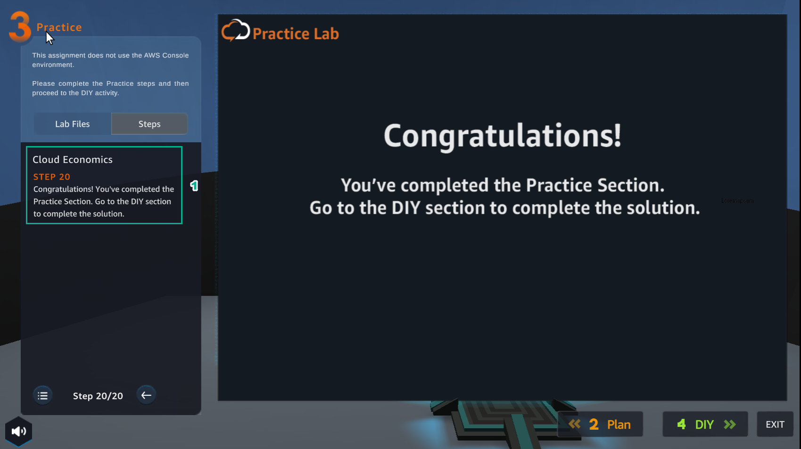

PRACTICE

===================

.. info::

   After watching **Plan**, the player prepares for **Practice**

1. In the **Practice** interface

- Read step 1 of **Cloud Economics**

- Read **CONCEPT**

- Select the arrow to the right to see the next step

.. image:: pictures/0001A5-practice.png
   :align: center
   :width: 700px

2. In the **Practice** interface

- Read step 2 of **Cloud Economics**

- Read **CONCEPT**

- Select the arrow to the right to see the next steps

.. image:: pictures/0002A5-practice.png
   :align: center
   :width: 700px

3. Open the browser

- Access to **AWS Pricing Calculator**

- Select **Create estimate**

4. In the **Practice interface**

- Read step 3 of **Cloud Economics**

- Read **CONCEPT**

- Select the arrow to the right to see the next steps

.. image:: pictures/0004A5-practice.png
   :align: center
   :width: 700px

5. Select **My Estimate**

.. image:: pictures/0005A5-practice.png
   :align: center
   :width: 700px

6. In the **Practice** interface

- Read step 4 of **Cloud Economics**

- Read **CONCEPT**

_ Select the arrow to the right to see the next steps

.. image:: pictures/0006A5-practice.png
   :align: center
   :width: 700px

7. In the **My Estimate** interface

- Select **Add group**

8. In the **Practice** interface

- Read step 5 of **Cloud Economics**

- Read **CONCEPT**

- Select the arrow to the right to see the next steps

9. In the **Add group** interface

- In **Group settings**, **Group name field** enter Web Servers

- Then, select **Add group**

10. In the **Practice** interface

- Read step 6 of **Cloud Economics**

- Read **CONCEPT**

- Select the arrow to the right to see the next steps

11. In the **Web Server** interface

- Select **Add service**

.. image:: pictures/00011A5-practice.png
   :align: center
   :width: 700px

12. In the **Practice** interface

- Read step 7 of **Cloud Economics**

- Read **CONCEPT**

- Select the arrow to the right to see the next steps

13. In the **Add service** interface

- Find **EC2**

- Select **Configure**

.. image:: pictures/00013A5-practice.png
   :align: center
   :width: 700px

14. In the **Practice** interface

- Read step 8 of **Cloud Economics**

- Read **CONCEPT**

- Select the arrow to the right to see the next steps

15. In the **Configure Amazon EC2** interface

- In **Description**, enter **Web Server Estimate**

- **Region**, select US East (N. Virginia)

- Select **Advanced estimate**

.. image:: pictures/00015A5-practice.png
   :align: center
   :width: 700px

16. In the **Practice** interface

- Read step 9 of **Cloud Economics**

- Read **CONCEPT**

- Select the arrow to the right to see the next steps

17. In **EC2 instance specifications**

- **Operating system**, select **Linux**

- **Workload**, select **Daily spike traffic**

- **Workload days**, choose the days of the week

18. In the **Practice** interface

- Read step 10 of **Cloud Economics**

- Read **CONCEPT**

- Select the arrow to the right to see the next steps

.. image:: pictures/00018A5-practice.png
   :align: center
   :width: 700px

19. In **Daily spike pattern**

- **Baseline**, enter 2

- **Peak**, enter 4

- **Duration of peak** enter 8 and 0

20. In the **Practice** interface

- Read step 11 of **Cloud Economics**

- Read **CONCEPT**

- Select the arrow to the right to see the next steps

.. image:: pictures/00020A5-practice.png
   :align: center
   :width: 700px

21. In **EC2 Instances**

- Enter 2

- Select **4 GiB**

- Chon5 Any **Network Performance**

- Select **t2.medium**

.. image:: pictures/00021A5-practice.png
   :align: center
   :width: 700px

22. In the **Practice** interface

- Read step 12 of **Cloud Economics**

- Read **CONCEPT**

- Select the arrow to the right to see the next steps

23. In **Pricing** strategy

- Select **On-Demand**

- Select **Show calculations**

- Select **estimated workload hours**

.. image:: pictures/00023A5-practice.png
   :align: center
   :width: 700px

24. In the **Practice** interface

- Read step 13 of **Cloud Economics**

- Read **CONCEPT**

- Select the arrow to the right to see the next steps

.. image:: pictures/00024A5-practice.png
   :align: center
   :width: 700px

25. View **Estimated workload hours**

.. image:: pictures/00025A5-practice.png
   :align: center
   :width: 700px

26. In the **Practice** interface

- Read step 14 of **Cloud Economics**

- Read **CONCEPT**

- Select the arrow to the right to see the next steps

27. In **Amazon Elastic Block Storage (EBS)**

- **Storage for each EC2 instance**, select **General Purpose SSD (gp2)**

- **Storage amount((, enter 30
                   
- **Snapshot Frequency**, select **Weekly**
                   
- **Amount changed per snapshot**, select 1
                   

28. In the **Practice** interface

- Read step 15 of **Cloud Economics**

- Read **CONCEPT**

- Select the arrow to the right to see the next steps

29. In **Data Transfer**

- **Select Internet (free)**, enter 1, select **TB per month**

- In **Outbound Data Transfer**, select **Internet($0.05 - $0.09 per GB)**, enter 100, select **GB per month**

- Select **Show calculations**

.. image:: pictures/00029A5-practice.png
   :align: center
   :width: 700px

30. In the **Practice** interface

- Read step 16 of **Cloud Economics**

- Read **CONCEPT**

- Select the arrow to the right to see the next steps

.. image:: pictures/00030A5-practice.png
   :align: center
   :width: 700px

31. Review and select **Add to my estimate**

.. image:: pictures/00031A5-practice.png
   :align: center
   :width: 700px

32. In the **Practice** interface

- Read step 17 of **Cloud Economics**

- Read **CONCEPT**

- Select the arrow to the right to see the next steps

33. Result interface **Web Servers**, select **Share**

34. In the **Practice**interface

- Read step 18 of **Cloud Economics**

- Read **CONCEPT**

- Select the arrow to the right to see the next steps

.. image:: pictures/00034A5-practice.png
   :align: center
   :width: 700px

35. In **Save estimate**

- Select **Agree and continue**

.. image:: pictures/00035A5-practice.png
   :align: center
   :width: 700px

36. In the **Practice** interface

- Read step 19 of **Cloud Economics**

- Read **CONCEPT**

- Select the arrow to the right to see the next steps

.. image:: pictures/00036A5-practice.png
   :align: center
   :width: 700px

37. Select **Copy public link**

.. image:: pictures/00037A5-practice.png
   :align: center
   :width: 700px

38. Congratulations to the player on completing the lab

                   

