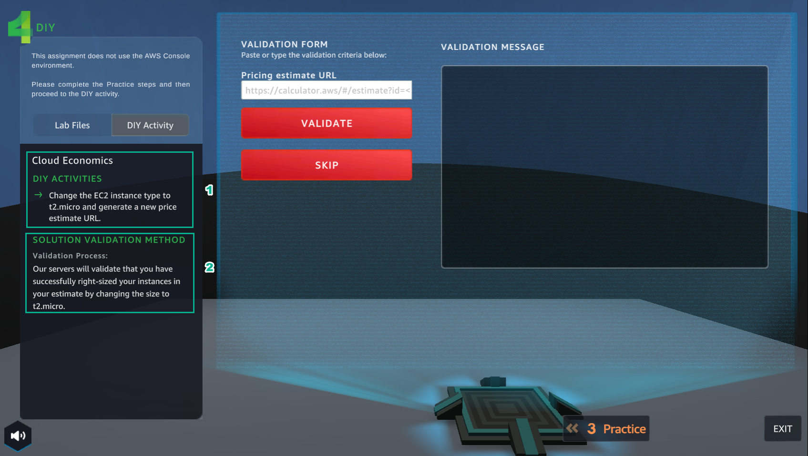

A6 - Connecting Amazon VPCs
========================

.. raw:: html

   <h2 class="my-header">Overview</h2>

Lab #6 of **AWS Cloud Quest: Cloud Practitioner** is **Connecting Amazon VPCs**

1. In **ASSIGNMENTS**

- Select **ROUTE AND GO**

2. Select the ! icon

3. Select **NEXT**

- View **Rewards**

4. Select **ACCEPT**

5. See **Solution Annotations**

- Select **GO TO SOLUTION CENTER**

