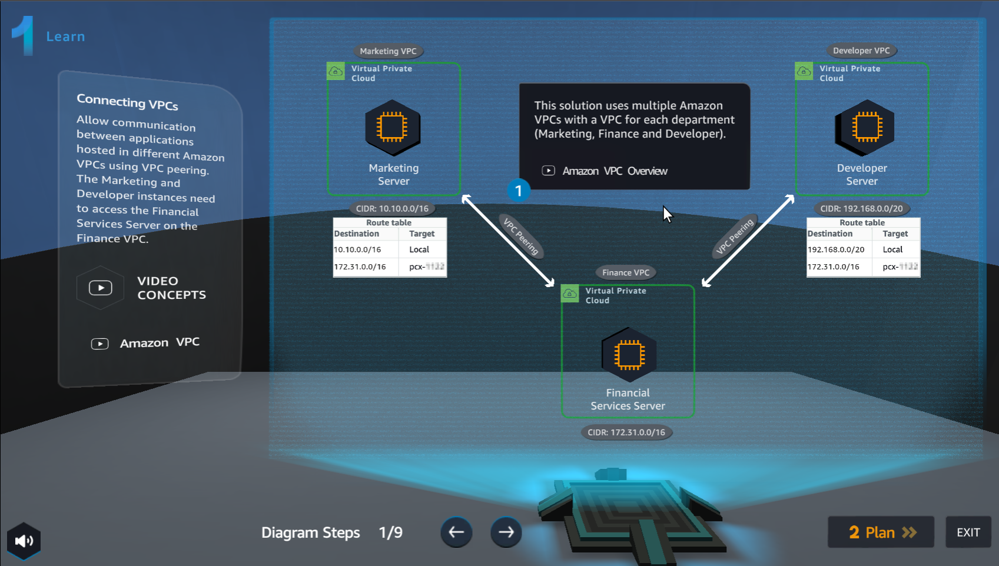
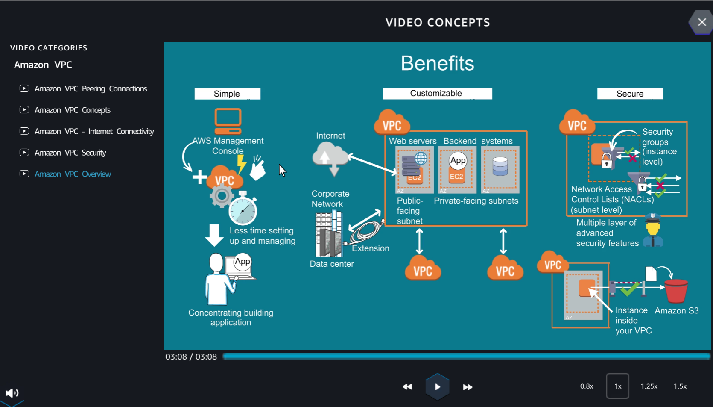
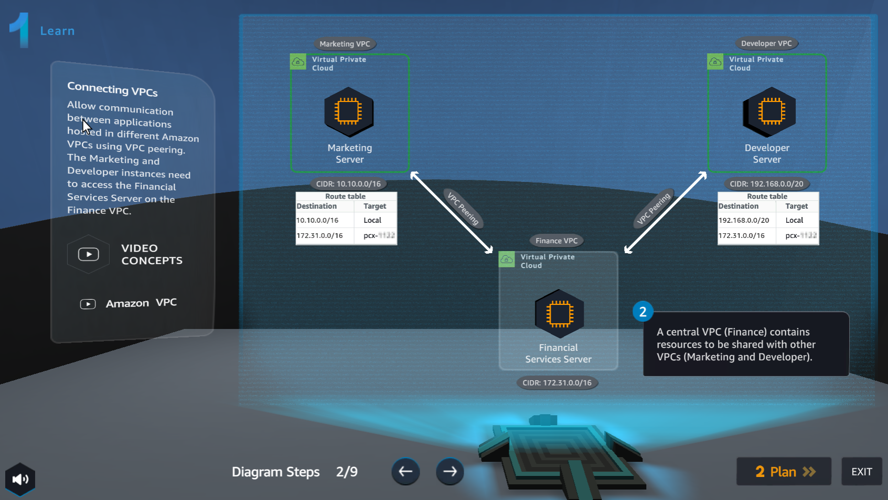
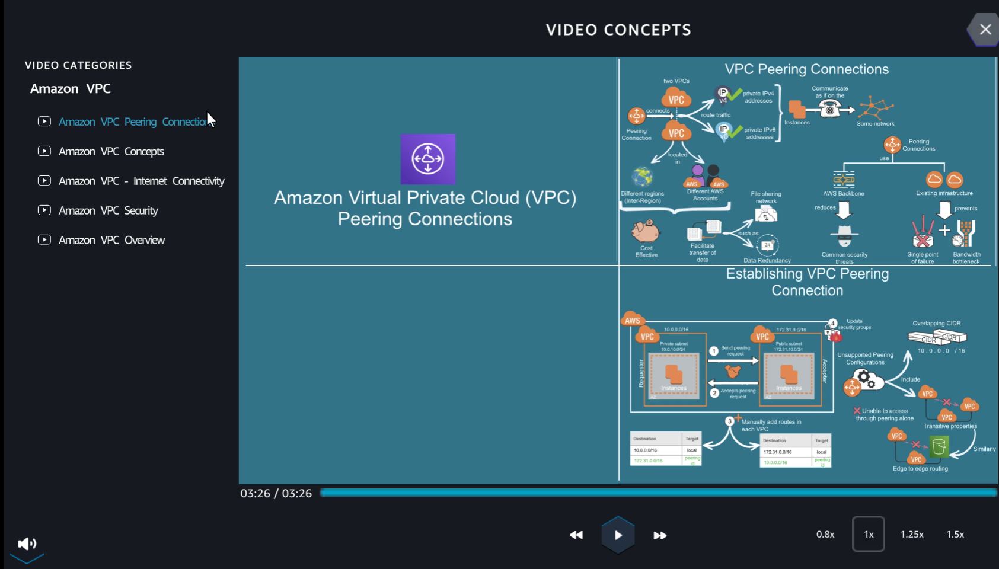
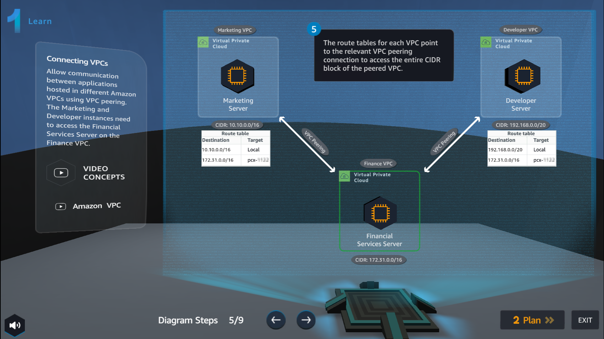
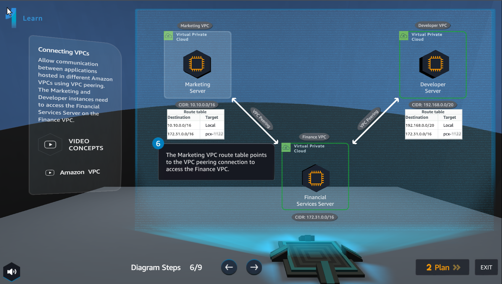
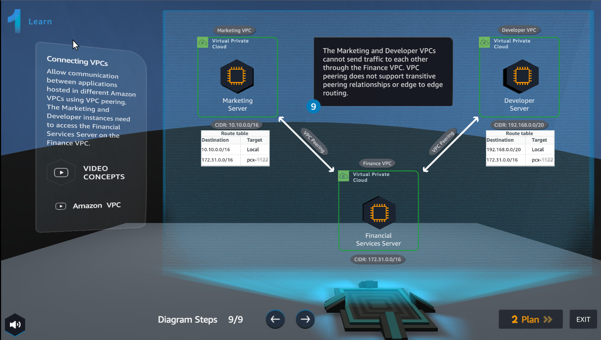

Learn
================

.. info::

    **Learn** helps players understand more theory about **Connecting VPCs**.

1. In the **Learn** interface

- See step 1 of **Diagram Steps**

- Select **Amazon VPC Overview**

2. Watch video **Amazon VPC Overview**

- Select **X** to exit

3. In the **Learn** interface

- See step 2 of **Diagram Steps**

4. In the **Learn** interface

- See step 3 of **Diagram Steps**

- Select **Amazon VPC Peering Connections**

5. Watch a video about **Amazon VPC Peering Connections**

- Select **X** to exit 

6. In the **Learn** interface

- See step 4 of **Diagram Steps**

- Select **Amazon VPC Peering Connections**

7. Watch video **Amazon VPC Peering Connections**

- Select **X** to exit

.. image:: pictures/0007a6-learn.png
   :align: center
   :width: 700px

8. In the **Learn** interface

- See step 5 of **Diagram Steps**

9. In the **Learn** interface

- See step 6 of **Diagram Steps**

10. In the **Learn** interface

- See step 7 of **Diagram Steps**

.. image:: pictures/00010a6-learn.png
   :align: center
   :width: 700px

11. In the **Learn interface**

- See step 8 of **Diagram Steps**

12. In the **Learn** interface

- See step 9 of Diagram Steps

