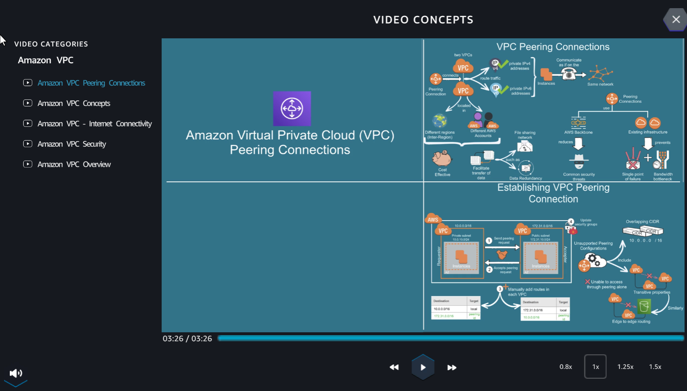
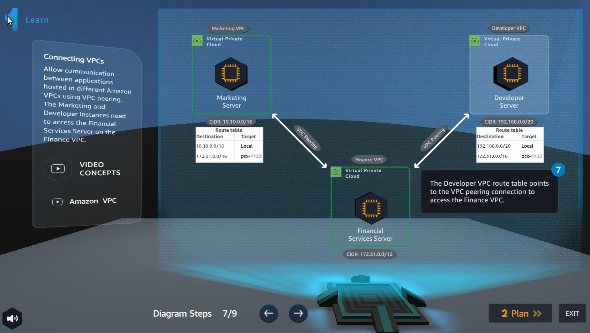

Learn
================

.. info::

    **Learn** helps players understand more theory about **Connecting VPCs**.

1. In the **Learn** interface

- See step 1 of **Diagram Steps**

- Select **Amazon VPC Overview**

.. image:: pictures/0001a6-learn.png
   :align: center
   :width: 700px

2. Watch video **Amazon VPC Overview**

- Select **X** to exit

3. In the **Learn** interface

- See step 2 of **Diagram Steps**

.. image:: pictures/0003a6-learn.png
   :align: center
   :width: 700px

4. In the **Learn** interface

- See step 3 of **Diagram Steps**

- Select **Amazon VPC Peering Connections**

.. image:: pictures/0004a6-learn.png
   :align: center
   :width: 700px

5. Watch a video about **Amazon VPC Peering Connections**

- Select **X** to exit 

.. image:: pictures/0005a6-learn.png
   :align: center
   :width: 700px

6. In the **Learn** interface

- See step 4 of **Diagram Steps**

- Select **Amazon VPC Peering Connections**

7. Watch video **Amazon VPC Peering Connections**

- Select **X** to exit

8. In the **Learn** interface

- See step 5 of **Diagram Steps**

.. image:: pictures/0008a6-learn.png
   :align: center
   :width: 700px

9. In the **Learn** interface

- See step 6 of **Diagram Steps**

.. image:: pictures/0009a6-learn.png
   :align: center
   :width: 700px

10. In the **Learn** interface

- See step 7 of **Diagram Steps**

11. In the **Learn interface**

- See step 8 of **Diagram Steps**

12. In the **Learn** interface

- See step 9 of Diagram Steps

