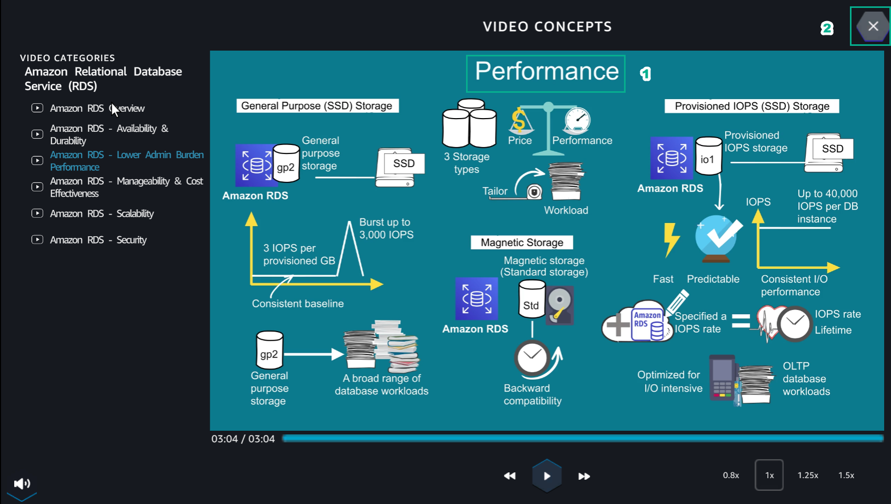
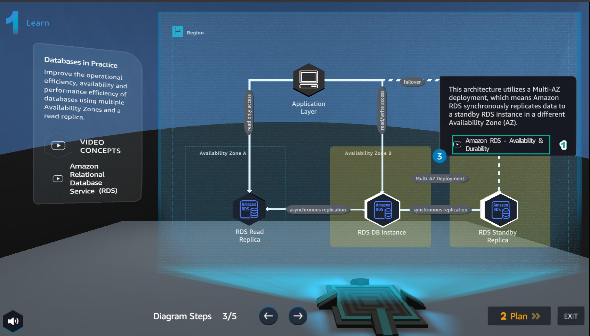
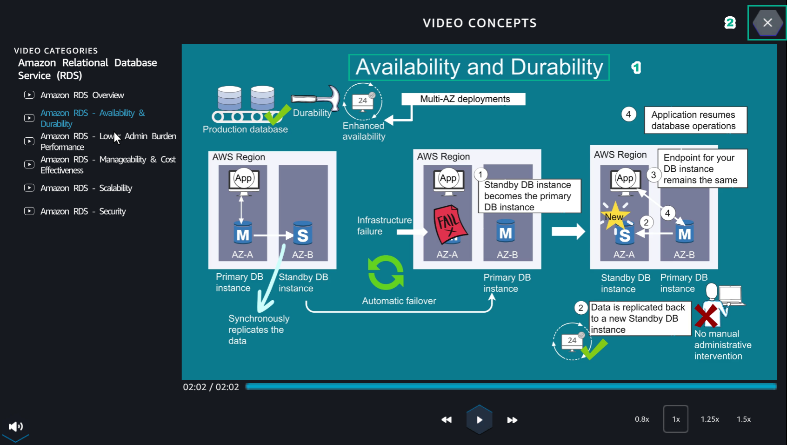
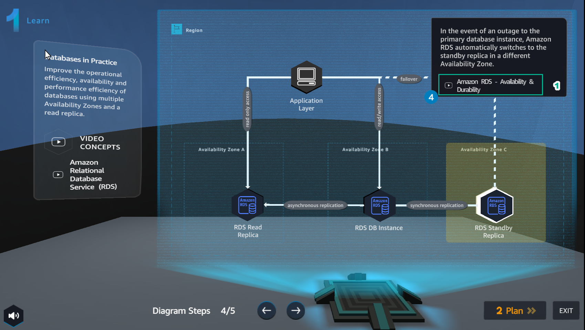
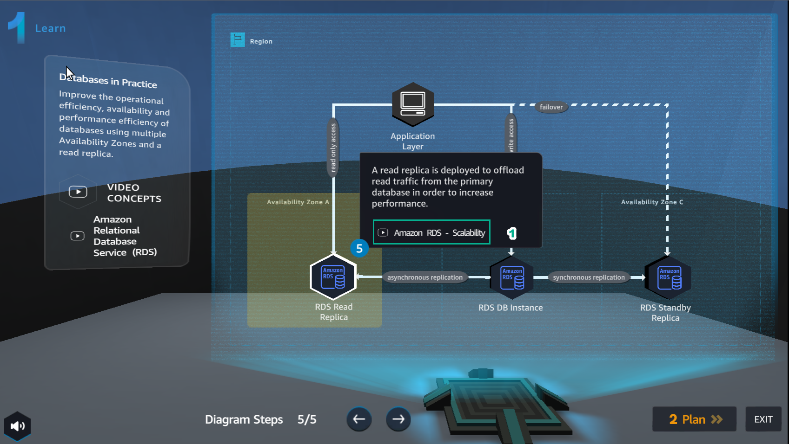
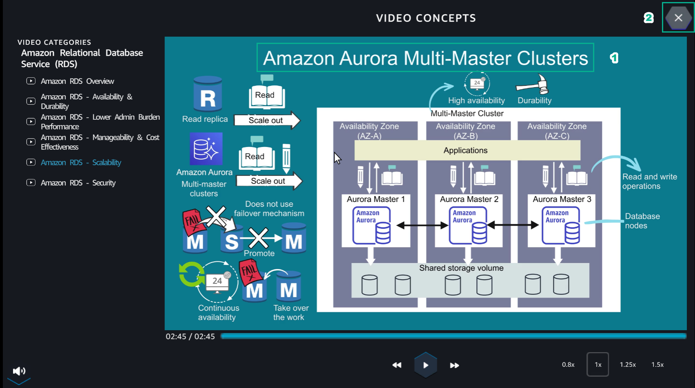

Learn
======

**Learn** helps players to understand more theory about

1.In the **Learn** interface

- Read step 1 of **Diagram Steps**
- Select **Amazon RDS Overview**

.. image:: pictures/learn_next.png
   :align: center
   :width: 700px

2.In the **VIDEO CONCEPTS** interface

- Watch video **Amazon RDS Overview**
- Select **X** to exit

.. image:: pictures/video_conceps.png
   :align: center
   :width: 700px

3.In the Learn interface

- Read step 2 of **Diagram Steps**
- Select **Amazon RDS - Lower Admin Burden Performance**

.. image:: pictures/learn_interface.png
   :align: center
   :width: 700px

4. In the **VIDEO CONCEPTS** interface

- Watch the video **Amazon RDS - Lower Admin Burden Performance**
- Select **X** to exit

5. In the **Learn** interface

- Read step 3 of **Diagram Steps**
- Select **Amazon RDS - Availability & Durability**

6. In the **VIDEO CONCEPT** interface

- Watch video **Amazon RDS - Availability & Durability**
- Select **X** to exit

7. In the **Learn** interface

- Read step 4 of **Diagram Steps**
- Select **Amazon RDS - Availability & Durability**

8. In the **VIDEO CONCEPTS** interface

- Watch video **Amazon RDS - Availability & Durability**
- Select **X** to exit

.. image:: pictures/0008-learn.png
   :align: center
   :width: 700px

9. In the **Learn** interface

- Read step 5 of **Diagram Steps**
- Select **Amazon RDS - Scalability**

10. In the **VIDEO CONCEPT interface**

- Watch video **Amazon RDS - Scalability**
- Select **X** to exit

