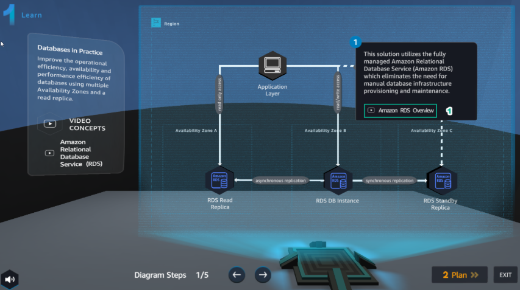
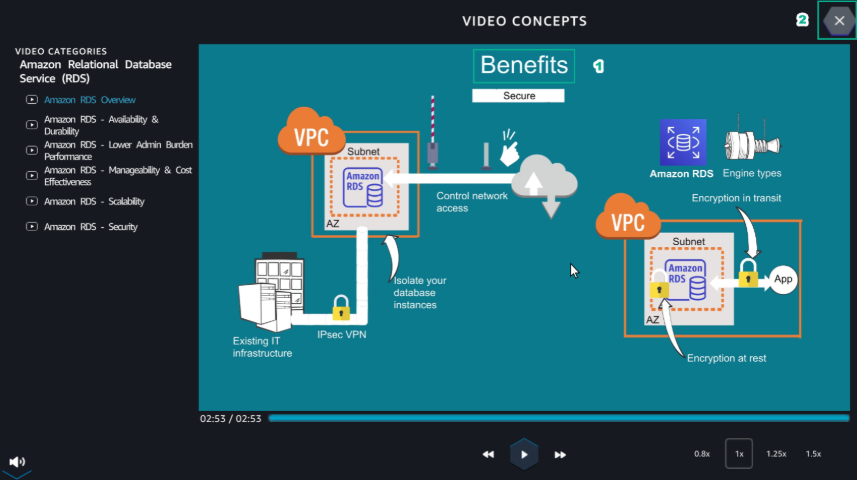
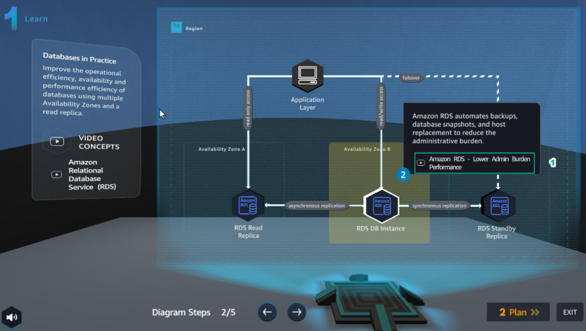

Learn
======

**Learn** helps players to understand more theory about

1.In the **Learn** interface
Read step 1 of **Diagram Steps**
Select **Amazon RDS Overview**

2.In the **VIDEO CONCEPTS** interface

Watch video **Amazon RDS Overview**
elect **X** to exit

3.In the Learn interface
Read step 2 of **Diagram Steps**

Select **Amazon RDS - Lower Admin Burden Performance**

