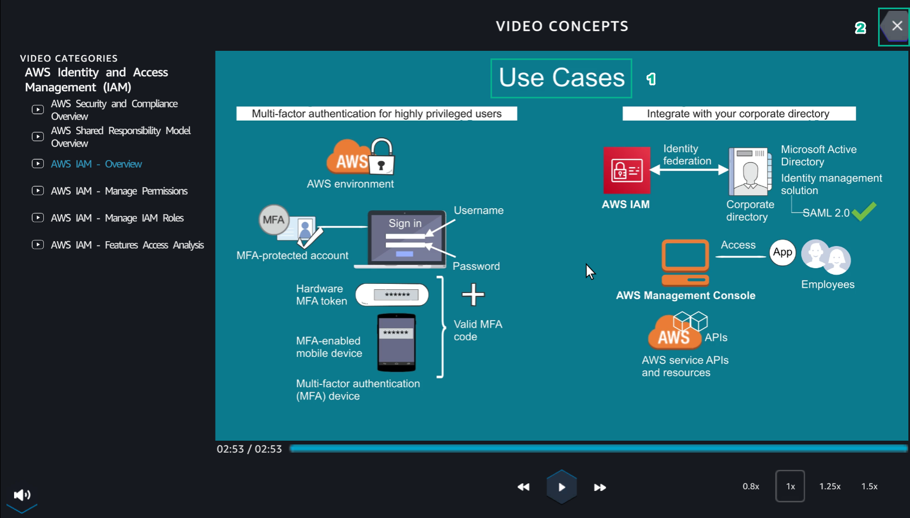
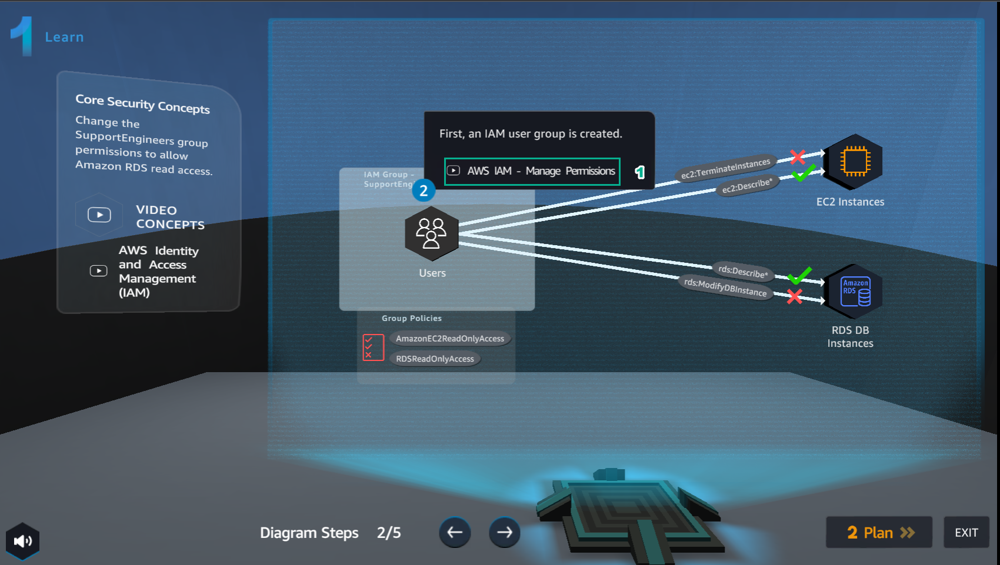
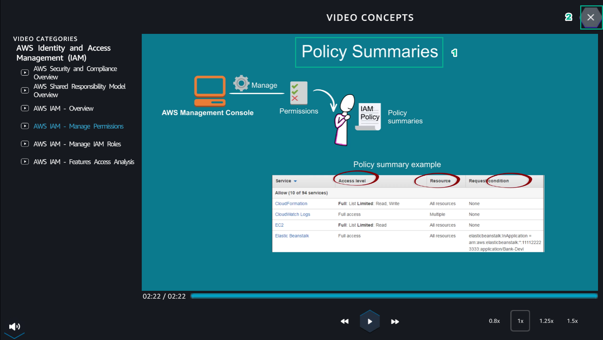
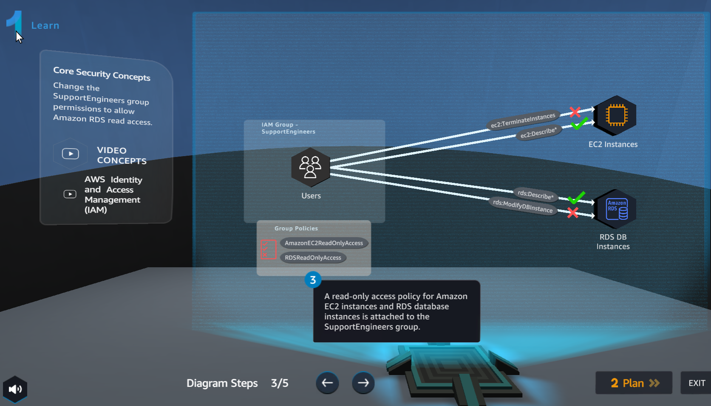
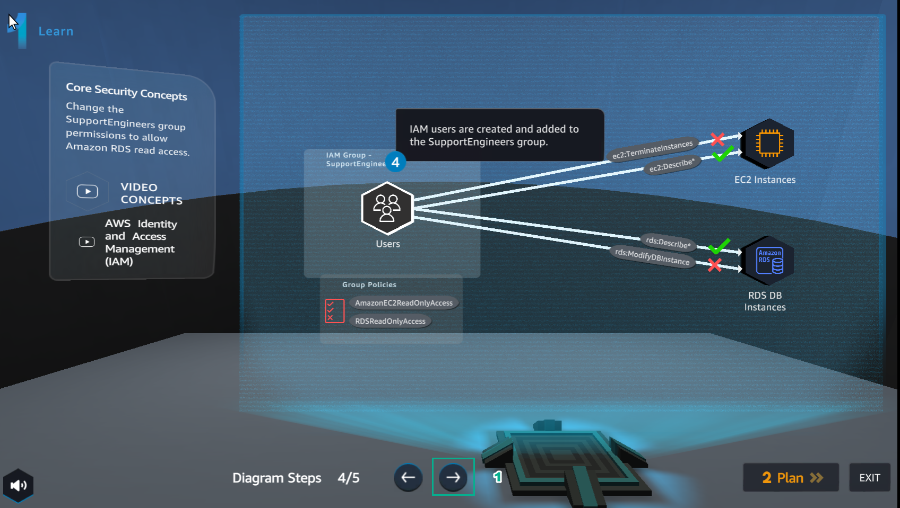
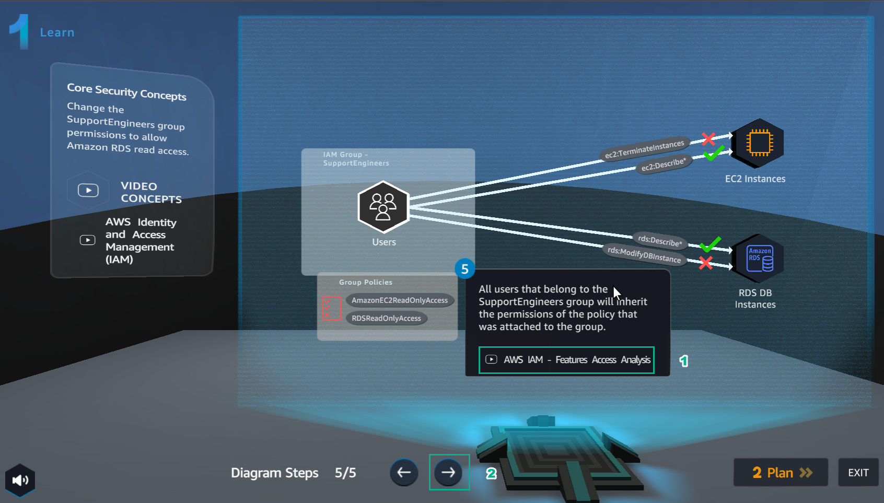

Learn
===========

.. info::

    Learn helps players to understand more theory about.

1.In the **Learn** interface

- Select **AWS IAM - Overview**

.. image:: pictures/a80001-learn.png
   :alt: Diagram
   :align: center
   :width: 700px

2. In the **VIDEO CONCEPTS** interface

- Watch video **AWS IAM - Overview**
- Select **X**

3. In the **Learn** interface

- Select **AWS IAM - Manage Permissions**

4. In the **VIDEO CONCEPTS** interface

- Watch video **AWS IAM - Manage Permissions**
- Select **X**

5. In the **Learn** interface

- See step 3 of **Diagram Steps**

6. In the **Learn** interface

- See step 4 of **Diagram Steps**

7. In the **Learn** interface

- Select **AWS IAM - Features Access Analysis**
- Select **Plan**

