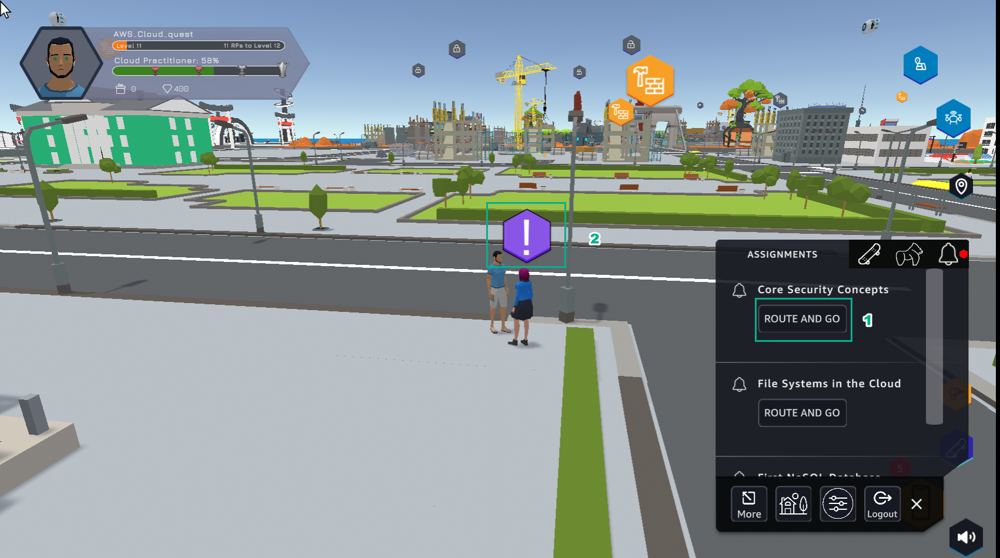
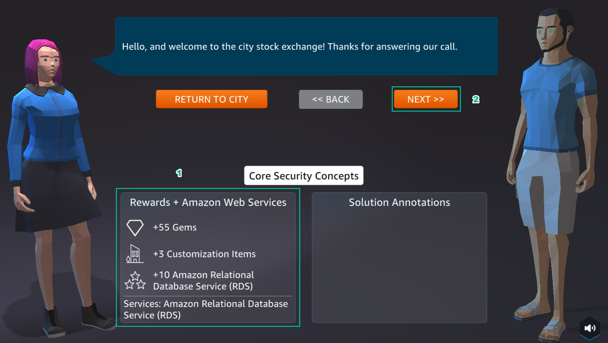
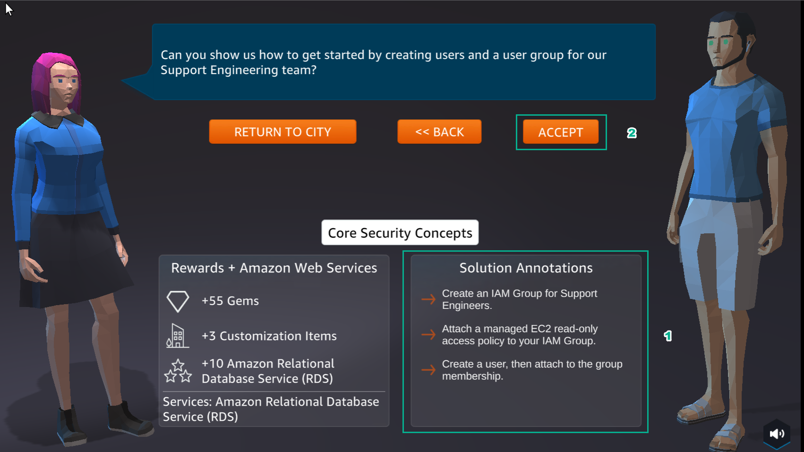
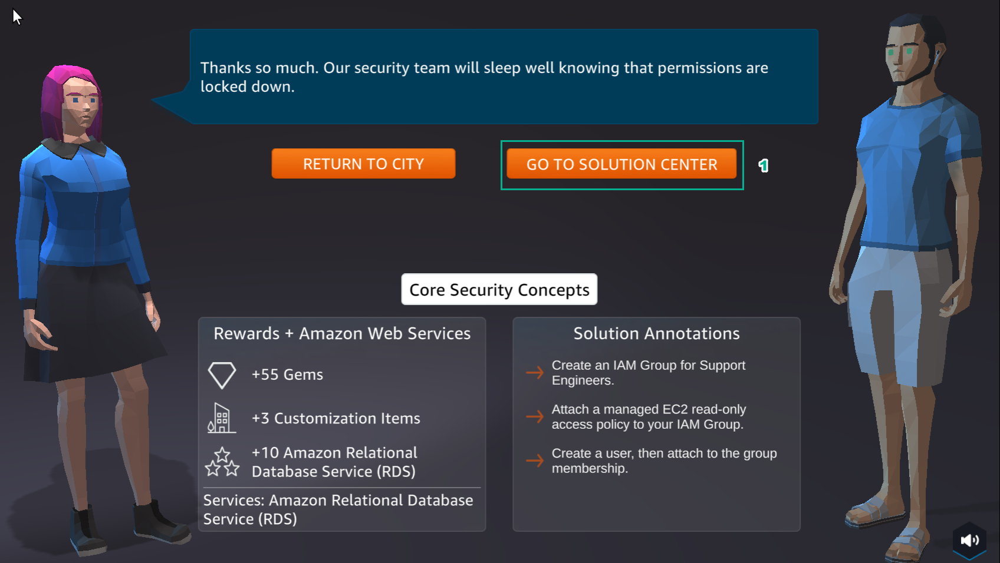

A8 - Security
===============

.. raw:: html

   <h2 class="my-header">Overview</h2>

**AWS Cloud Quest: Cloud Practitioner**’s 8th lab is **Defining Usr and Group Permissions using IAM Policies**.

1. In the city interface

- Select **ASSIGNMENTS**
- Select **ROUTE AND GO**
- Choose the icon !

2. In the city interface

- View **Rewards**
- Select **NEXT**

3. In the city interface

- See **Solution Annotations**
- Select **ACCEPT**

4. Select **GO TO SOLUTION CENTER**

.. toctree::
   :hidden:
   :maxdepth: 1

   a8 - learn
   a8 - plan
   a8 - practice
   a8 - diy
