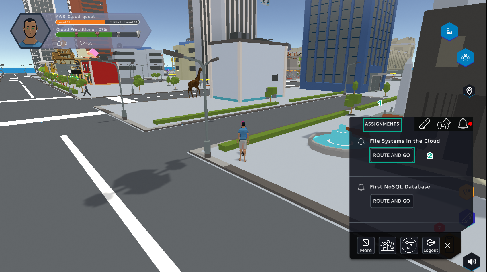

A9 - File Systems
==================

.. raw:: html

   <h2 class="my-header">Overview</h2>

Lab number 9 of **AWS Cloud Quest: Cloud Practitioner** is **File System in the Cloud using Amazon EFS**

1. In the city interface

- Select **ASSIGNMENTS**
- Select **ROUTE AND GO**

2. In the city interface

- Select the ! icon

3. In the **File System in the Cloud** interface

- View **Rewards**
- Select **NEXT**

4. In the **File Systems in the Cloud** interface

- See **Solution Annotations**
- Select **ACCEPT**

.. image:: pictures/a90004-filesystems.png
   :align: center
   :width: 700px

5. In the **File Systems in the Cloud** interface

- Select **GO TO SOLUTION CENTER** to prepare the next steps

.. toctree::
   :hidden:
   :maxdepth: 1

   a9 - learn
   a9 - plan
   a9 - practice
   a9 - diy

