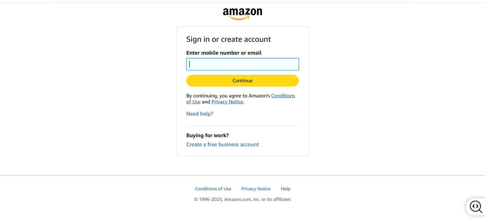
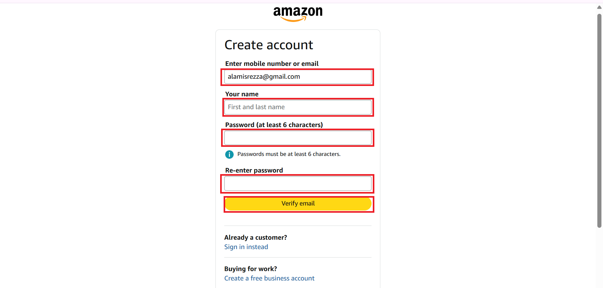

Create an account on Amazon
============================

.. info::

   To log in, you must use an Amazon e-commerce account (if you don’t have one, you can create one by following these steps).

Steps to create an Amazon account

1. Open the app or go to the official website `Amazon <https://www.amazon.com>`_

2. Select **Create a new Amazon account**

3. Enter **User name**
4. Enter **Mobile number** and **Email address** to connect
5. Enter **Password**
6. Enter **Re-enter password**
7. Next, select **Verify**

