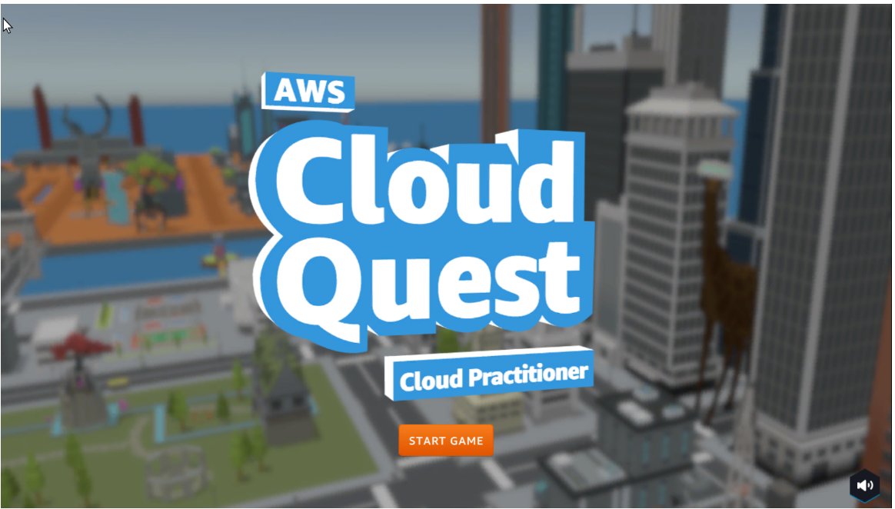

Welcome to Aws Cloud Practitioner!
===================================

Author: Macabinguil Aiya, Alamis Rezza Mea and Minor Kim Brylle

*Overview*

.. note::

   This project is under active development.

Contents
--------

.. toctree::
   :maxdepth: 1
   :numbered:
   :titlesonly:
   

   introduction
   preparation steps
   getting acquainted with aws cloud quest
   a1 - static web hosting
   a2 - launch an amazon EC2 instance
   a3 - connect to an EC2 instance
   a4 - internet access for vpc resources
   a5 -aws pricing calculator
   a6 - connecting amazon vpcs
   a7 - database
   a8 - security
   a9 - file systems
   a10 - nosql databases
   a11 - scaling
   a12 - highly available

   
   
