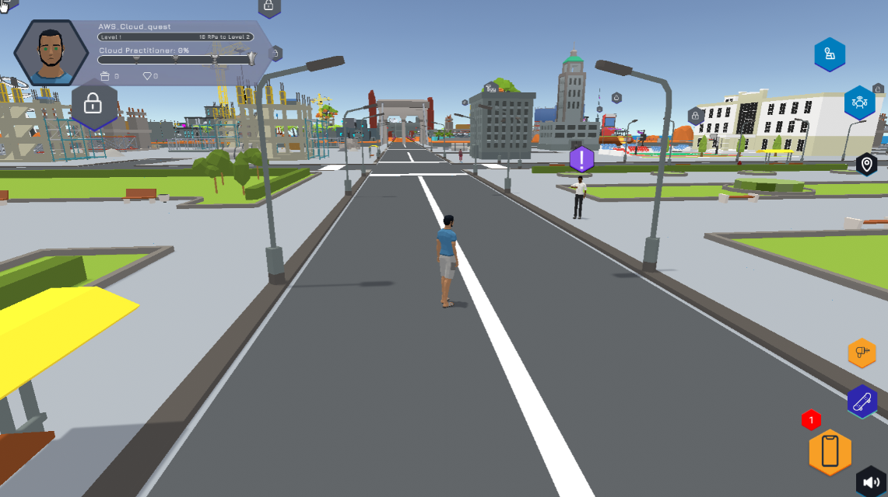

Register and Check the System
===============================
After logging in, the AWS Training and Certification interface appears with the courses.

1. Find and select **AWS Cloud Quest: Cloud Practitioner**
2. Continue, select **ENROLL**

3. After selecting ENROLL, select START **LEARNING NOW**.

4. Select Trailer Youtube video for an overview of **AWS Cloud Quest: Cloud Practitioner**

5. After watching the video, select **System Requirements** to check system requirements

- OS: 64Bit operating system (Windows, macOS and Linux)
- Storage: 1GB available space
- Network: Broadband internet connection
- Graphics: Integrated or dedicated 3D graphics (Note: M1 series Mac computers may experience periodic rendering issues)
- Browser: Firefox, Microsoft Edge and Google Chrome browser (HTML 5, WebGL 1.0 or 2.0, WASM)
- Mobile browsers are not supported.

6. After checking the system, select Play AWS Cloud Quest: Cloud Practitioner
7. The interface that appears includes 12 labs ̣ (Cloud Practitioner Assignments)

- Cloud Computing Essentials
- AWS Cloud First Steps
- Computing Solutions
- Cloud Economics
- Networking Concepts
- Connecting VPCs
- Databases in Practice
- File Systems in the Cloud
- Core Security Concepts
- First NoSQL Database
- Auto-healing and Scaling applications
- Highly Available Web Applications

8. Select **PLAY NOW!** (wait a few minutes for the theme to load)

9. **AWS Cloud Quest: Cloud Practitioner** interface appears, select **START GAME** (takes time to load the game)

.. image:: pictures/start_game.png
   :align: center
   :width: 700px

10. Done, the city interface has appeared.

